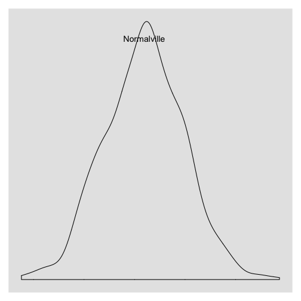
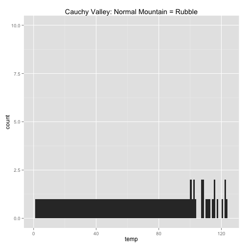
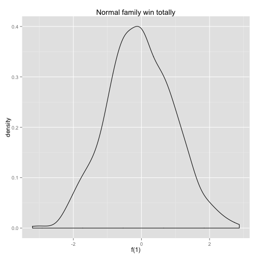
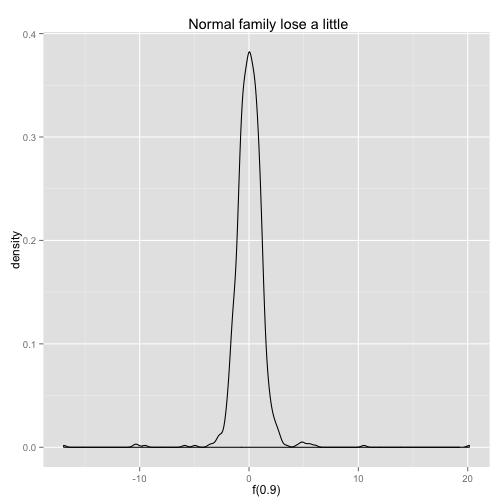
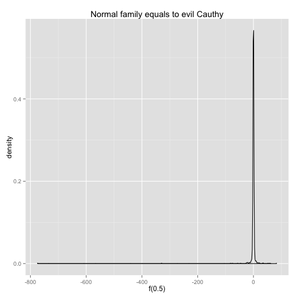
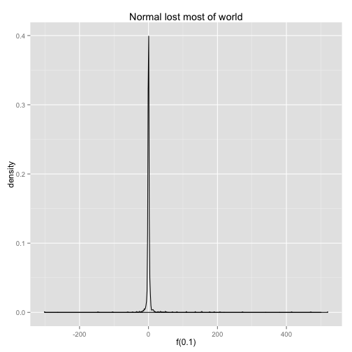
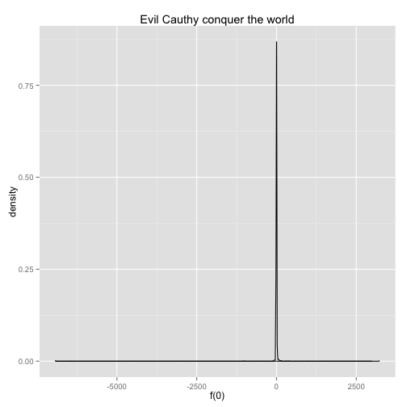

Normalville 
By: Danny Bero, Heijan Sang, Yixiao Zhang
========================================================

Once upon a time, the great city of Normalville thrived ontop of Normal Mountain. This mountain had special properties and all of the Normans, the name given to these people, were happy and worked together in peace. 


```r
x = rnorm(1000)
library(ggplot2)
p <- qplot(x, geom = "density", xlab = NULL, ylab = NULL)
p + geom_text(aes(x = 0, y = 0.4, label = "Normalville")) + theme(line = element_blank(), 
    text = element_blank(), line = element_blank(), title = element_blank())
```

 


One day Mr. Chi was balancing the daily variance of the city and noticed a HUGE problem. The variance was negative. 

All at once, the world seemed upside down, the groud shook violently and the citizens were tossed out of Normalville, off Normal Mountain, and into the cold valley below. They watched, paralyzed in fear, as their once great mountain dissapeared into rubble. 

Down in Cauchy Valley, the land of no mean or variance, the one great citizens of Normalville clung to survival through freezing winters and brutally hot summers. Without the normal curve, citzens no longer knew how to estimate the temperature and made very poor clothing choices. 


```r
temp = c(seq(1:100), runif(20, 100, 125))
qplot(temp, geom = "Histogram", binwidth = 1, ylim = c(0, 10), main = "Cauchy Valley: Normal Mountain = Rubble")
```

 


One day, when Mr. Chi was walking around Cauchy Valley, he found a little boy crying. "Why are you crying?" asked Mr. Chi. The boy, in utter despair, responded, "because I cannot find out the probability that I will score between a 75 and a 95 on my upcoming exam!" These were serious times. 

The Abnormal people watched from afar as the Normans struggled to become accustomed to Cauchy Valley. They hated the Normans and had been plotting their revenge since 30 years  earlier when King Normal IV sentenced them to exile because they couldn't generate enough moments. Now they had the upper-hand and they were prepared crush the people of Normalville once and for all!


```r
f = function(x) 1 + x + x^2 + x^3 + x^4
curve(f, -10000, 10000, main = "the world of Normal Mountain is Down")
```

 


The fight began and the Normans were left utterly defenseless without their precious mean and variance assumption. They couldn't predict the Abnormals' movements, much less their heights, weights, and foot lengths. The outlook of the fight looked bleak and the Normans numbers were dwindling quickly. Their only hope lied in the brain one little girl named Deviation. She told the Normans of a dream she had the night before. A dream about "The Great Z Score," a diety who could save the Normans from the rather precarious situation they found themselves in. She spoke of the power of standardizing using means and variances and left the crowd of Normans speachless. This would be the key to their survival. 


```r
f = function(alpha) alpha * rnorm(1000) + (1 - alpha) * rcauchy(1000, location = 0, 
    scale = 1)
qplot(f(1), geom = "density", main = "Normal family win totally")
```

 

```r
qplot(f(0.9), geom = "density", main = " Normal family lose a little")
```

 

```r
qplot(f(0.5), geom = "density", main = "Normal family equals to evil Cauthy")
```

 

```r
qplot(f(0.1), geom = "density", main = "Normal lost most of world")
```

 

```r
qplot(f(0), geom = "density", main = "Evil Cauthy conquer the world")
```

 


The rest of the story, as they say, writes itself. Today, you can find the people of Normalville sipping on kool aid, talking, and laughing. One would say they were generating moments once again. 

The end. 


