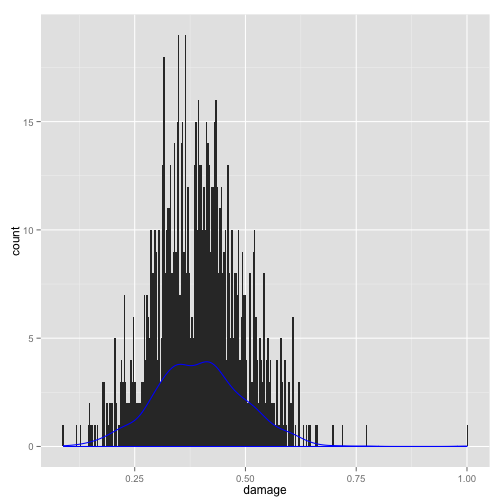
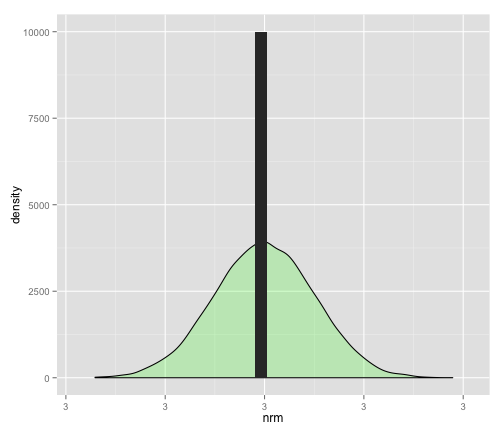
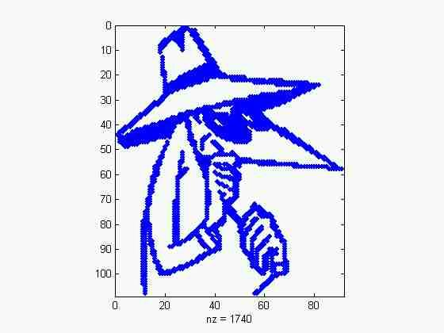

Taming of Chance
========================================================
*Joel Willers*
*Jessica Short*
*Sen Zhou*
*Junzhao Hu*

It was a dark day at the ACME widget factory. A suspicious character was lurking in the corner of the huge manufacturing floor. Unknown to the employees, the stranger was ready to ruin their recent batch of widgets.

Sneaking between the giant machines towering like pillars of creation, the man made a small, but obvious, dent in a widget. The saboteur knew that the quality control people would catch the mistake. Without knowing about the normal curve, there was no way to determine if this widget was an outlier, and the entire batch would have to be destroyed.

 

His job done, the man crept into the ventilation duct system to escape. He could have left through the unlocked back door, but this made him feel more like a spy, which was his childhood dream. Last week, he had switched the screws of the widgets. What would be his diabolical plot next week, he wondered...

'BOB!' yelled Mr. X, the manager of the plant. 'Last week, the screws were measured for our widgets and some were less than 2.5 inches!!'

Bob Replied: 'I'm sorry sir, we do quality control every night - I have workers measuring the screws on all the shifts'

Mr. X insisted that Bob stay all night counting screws, after all they had recently increased production and he couldn't have quality falling off at this important time of his business. In his mind, all of the screws leaving his factory should measure 3 inches. How else could he maintain quality?

#### Mr. X's idea of screw distribution, and the hidden normal
 

Bob wished there was something that could keep him from working all night counting screws. Little did he know, that there was a normal distribution behind the scenes, undiscovered. 
He knew that he need some knowledge about normal distribution to test the outliers of these widgets,but he didn't learn quite well in this area. So he asked his friend Jim, who is a statistics PHD student now and consulted the normal distribution. After Jim expained to him, he could examined the batch of widgets now. 
He knew that the screw should be 3 inches long normally, and he calculated the 95% confidence interval[2.80,3.12], and if the length of any screw is not the this interval, he would treat it as an outlier and disgard it.After checking that, he found that there were so many outliers, and he reported this to his manager. Then they called the police, and the policemen checked the camera installed in the room.

Well, the camera did catch a guy. 

But, it also catched something weird. It looks like 
 

yes, a bunny.

