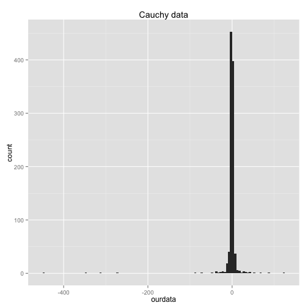
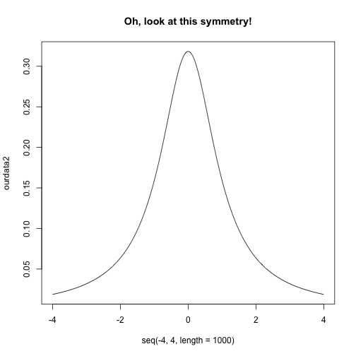
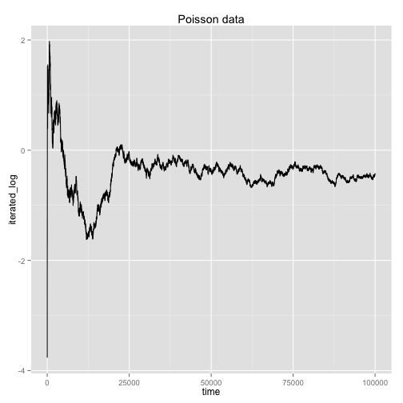
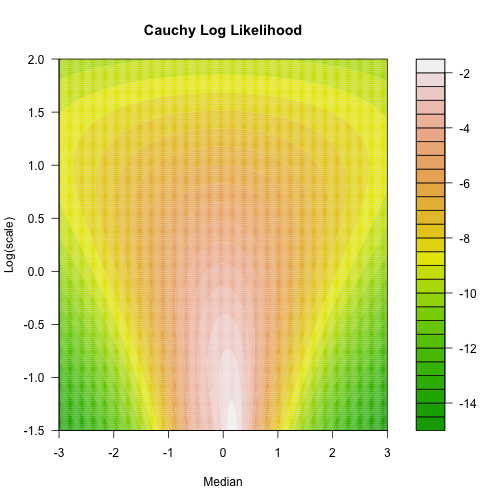

====
The world we live in ...
====
by I. Alvarez, G. Basulto, A. Erciulescu, Y. Nguyen


"Agrr, agrrr!" said Karl, but no one could understand him, it happens to him since he was a child. He knew how to fix it, just a little less weight on the tails and everithing will converge so much nicer... The Earth all trembeled and the clouds started to move as the there was not enough space in the sky for the sun to show up. 

But it was not the sun, it was ... Cauchy!!! Hahahaha!

```r
library(ggplot2)
set.seed(2014)
ourdata <- rcauchy(1000)
qplot(ourdata, binwidth = 5) + ggtitle("Cauchy data")
```

 

```r

ourdata2 <- dcauchy(seq(-4, 4, length = 1000))
plot(seq(-4, 4, length = 1000), ourdata2, type = "l", main = "Oh, look at this symmetry!")
```

 


Oh!, wait a moment!, Andrei said. 
Fisher's look seem to be lost on emptiness, without any expectation. -Moments? -he replies- But there are no moments, time has taken a different dimension. There are birds... and some flowers!!!

Andrei, the russian mastermind, master or all averages, claimed the average madness is the only way to put anything under control in the long run. So quickly started to average everything he had close to his hands...


```r
library(ggplot2)

set.seed(2014)

n <- 1e+05
ourdata <- cumsum(rcauchy(n))/(1:n)
ggplot(data.frame(time = 1:n, average_madness = ourdata), aes(time, average_madness)) + 
    geom_line() + ggtitle("Cauchy data")
```

 


"It's not working! What's going on there?" - said Andrei crying like there were no tomorrow. 

"There is no constrain by normality, how things can be converged?" Said Khinchin, at the moment, who randomly walked into the scene and with confidence saying: "no worry, without normality, we still will make it, there is an order in  mother nature". 

People are curious looking at him suppiously. Khinchin open his hand, and boom, here we are: the law of the iterated logarithm.


```r
library(ggplot2)
set.seed(2014)
n <- 1e+05
ourdata <- cumsum(rpois(n, 1) - 1)[-c(1, 2)]/sqrt((3:n) * log(log(3:n)))
ggplot(data.frame(time = 3:n, iterated_log = ourdata), aes(time, iterated_log)) + 
    geom_line() + ggtitle("Poisson data")
```

 


Moments later, he figured out he changed the problem and used a little help from Sim\'{e}on so he could make his random walk.

Cauchy was still the ruler, its name was gradually taken by future generations and it created a whole genealogy tree with its family. There most common gene was a location-scale family of distributions,

\[ f(x;\mu,\sigma) = \frac{1}{\pi \sigma} (1+(\frac{x-\mu}{\sigma})^2)^{-1} ,\]

and the specifics where given by $\mu=0$ and $\sigma=1$. The genealogy tree grew bigger and bigger and after many generations living in different eras and environmental changes, their dependence decreased and they started to differ more and more. Hence, the young \textit{Cauchy's} wondered, if they assumed independence, why not look at the log likelihood of the nodes of the largest part of the tree they were able to recover from their past. All the branches were pruned from the start so they felt confident to continue with their dream. And, so, the young \textit{Cauchy's} constructed the log likelihood of their $n$ ancestors base gene.


\[ log \prod_{i=1}^n f(x_i;\mu,\sigma) = - \sum_{i=1}^n log(1+(\frac{x_i-\mu}{\sigma})^2) - n log (\pi \sigma),\]
 of which, again $\mu=0$ and $\sigma=1$ gave their own specifics. 


 

