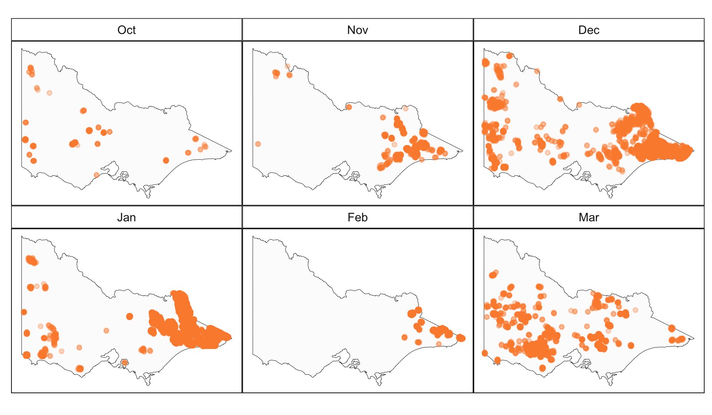
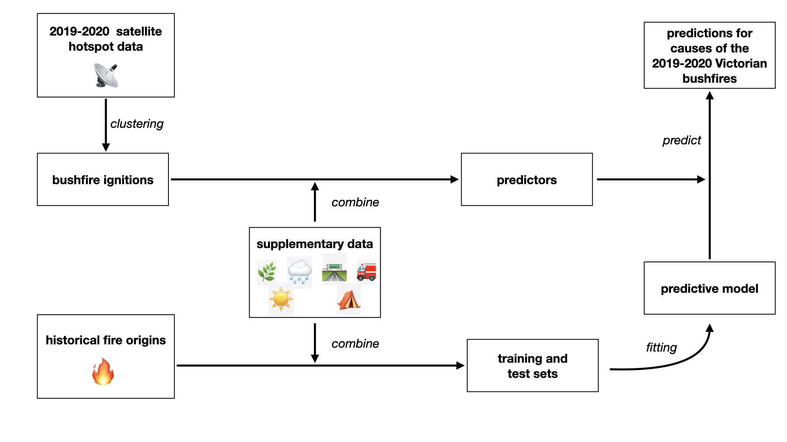
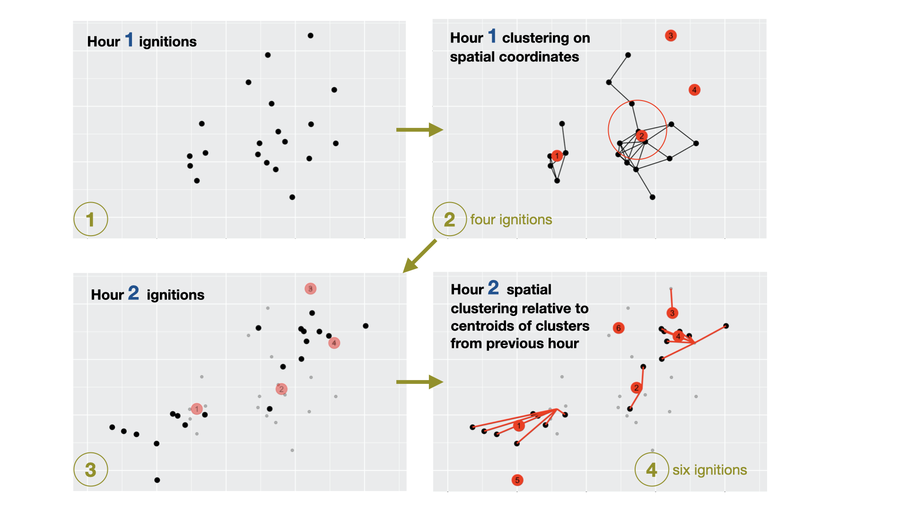
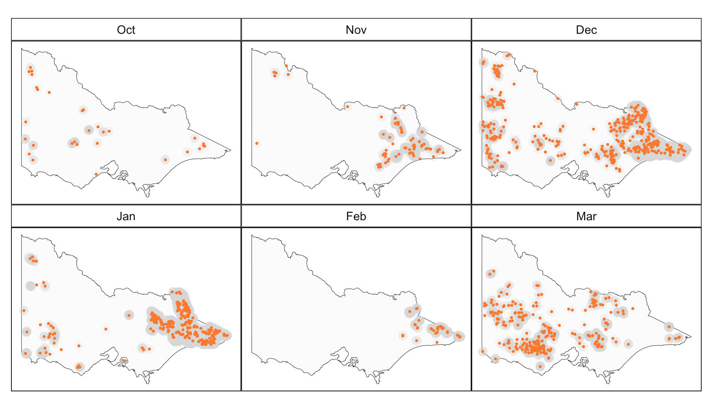
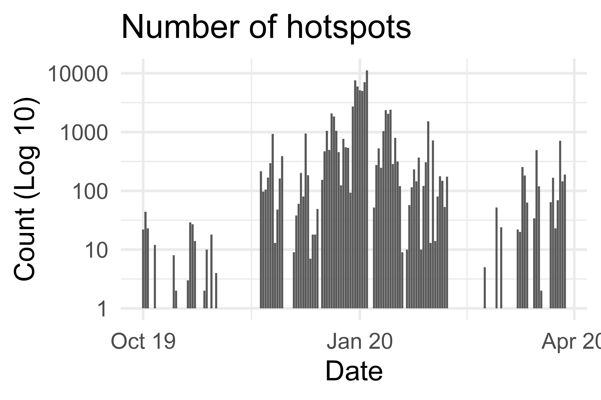
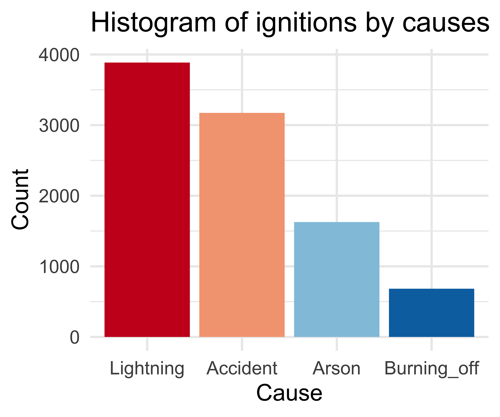
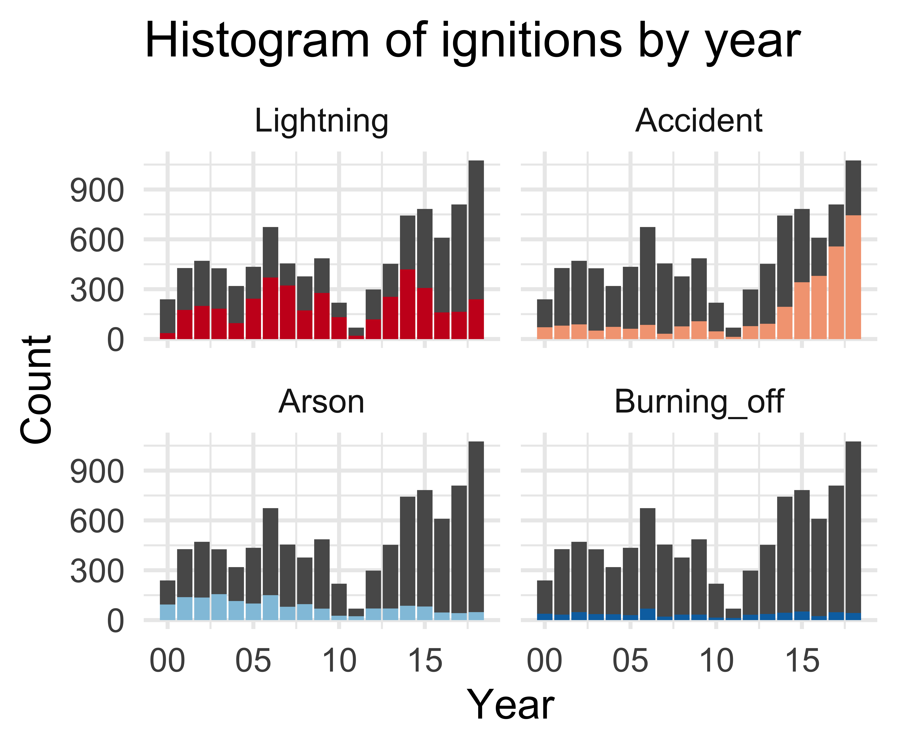
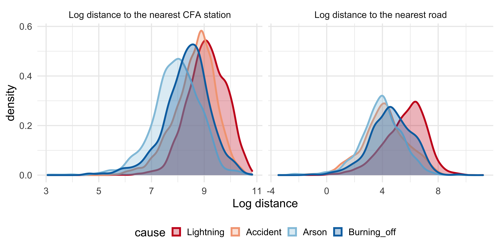
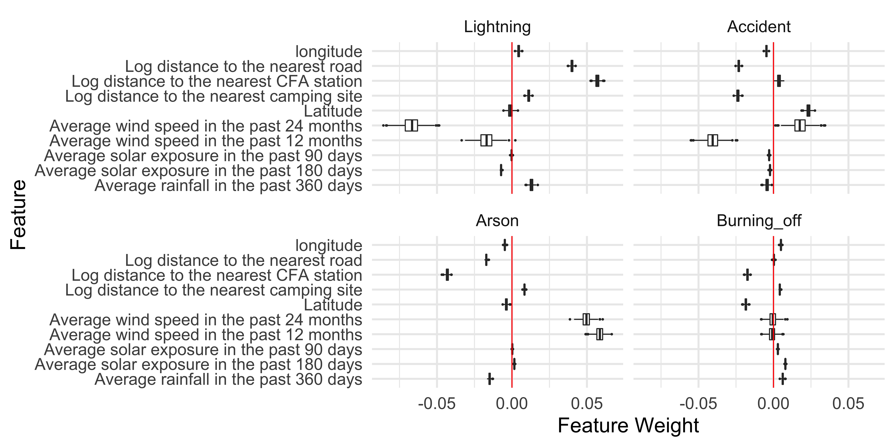

```{r setup, include=FALSE}
knitr::opts_chunk$set(echo = FALSE, message = FALSE, warning = FALSE)
library(tidyverse)
Sys.setlocale("LC_ALL","English")
```

```{r titleslide, child="components/titleslide.Rmd"}
```

---
# People and motivation

<table>
<tr>
<td>  </td> 
<td width="100px"> </td>
<td>  </td>
</tr>
<tr>
<td> Weihao Li  </td> 
<td> </td>
<td>
Emily Dodwell  </td>
</tr>
<tr>
<td> Monash EBS Honours  </td> 
<td> </td>
<td>
AT&T research  </td>
</tr>
</table>

<br>

*Motivation*: Spatio-temporal visualisation and analysis of emergency call data. This is private so the bushfire data was collected because it has some similar form and structure.

---
# 🗺 Background


<h2>⚡  Lightning or 🔥Arson?</h2>


<!-- https://twitter.com/MRobertsQLD/status/1220588928706568193 -->
---
# 📡 Remote sensing data

Japan Aerospace Exploration Agency  provides a hotspot product (reflected energy from the earth) taken from the **Himawari-8** satellite.

.footnote[[Example code to access data provided in a G. Williamson gist post](https://gist.github.com/ozjimbob/80254988922140fec4c06e3a43d069a6)]
```{r}
if (!file.exists("images/hotspots_before.png")){
  library(rnaturalearth)
  library(ggthemes)
  library(lubridate)
  au_map <- ne_states(country = 'Australia', returnclass = 'sf')
  vic_map <- au_map[7,]
  VIC_hotspots_before_clustering <- read_csv("data/VIC_hotspots_before_clustering.csv") %>%
    mutate(date = as.Date("2019-10-01") + hours(time_id)) %>%
    mutate(month = month(date, label = TRUE)) %>%
    mutate(month = factor(month, levels = c("Oct", "Nov", "Dec", "Jan", "Feb", "Mar")))

  p <- ggplot(VIC_hotspots_before_clustering) +
    geom_sf(data = vic_map, fill = "grey99", 
            colour = "black", size=0.1) +
    geom_point(aes(lon, lat), size = 1, 
               alpha=0.3, colour = "#fd8d3c") +
    facet_wrap(~month, ncol=3) +
    theme_map() + 
    theme(strip.background = element_rect(fill="white"),
          panel.border = element_rect(colour="black", fill=NA))
  
  ggsave(p, filename = "images/hotspots_before.png", height = 3.5, width = 6, dpi = 300)
}
```





---
# 📂 Data Sources

.monash-red2[**🔥 Historical fire origins**]: .font_my_2[[Department of Environment, Land, Water and Planning](https://discover.data.vic.gov.au/dataset/fire-origins-current-and-historical)]

.monash-red2[**📡 Remote sensing data**]: .font_my_2[[Japan Aerospace Exploration Agency](https://www.eorc.jaxa.jp/ptree/userguide.html)]

.font_my[
**Wind speed data**: 1-day average, 7-day average, ..., 2-year average from .font_my_2[[Commonwealth Scientific and Industrial Research Organisation and Automated Surface Observing System](https://doi.org/10.25919/5c5106acbcb02)]

**Temperature, Rainfall and Solar exposure**: 1-day average, 7-day average, 14-day average, 28-day average, ..., 720-day average computed from .font_my_2[[Bureau of Meteorology](https://CRAN.R-project.org/package=bomrang)]

**Fuel layer**: Forest type, forest height class, forest crown cover from .font_my_2[[Australian Bureau of Agricultural and Resource Economics](https://www.agriculture.gov.au/abares/forestsaustralia/forest-data-maps-and-tools/spatial-data/forest-cover)]

**Road map**: Proximity to the nearest road using .font_my_2[[OpenStreetMap](%20https://www.openstreetmap.org%20)]

**Fire stations**: Proximity to the nearest CFA station  .font_my_2[[Department of Environment, Land, Water and Planning](https://discover.data.vic.gov.au/dataset/cfa-fire-station-vmfeat-geomark_point)]

**Recreation sites**: Proximity to the nearest camping site .font_my_2[[Department of Environment, Land, Water and Planning](https://discover.data.vic.gov.au/dataset/recreation-sites)]
]

---

# 💻 Data fusion




---
# 💻 Detect ignitions by clustering hotspot data



---
# 💻 Estimated ignitions

```{r}
if (!file.exists("images/hotspots_after.png")){
  library(rnaturalearth)
  library(ggthemes)
  library(lubridate)
  au_map <- ne_states(country = 'Australia', returnclass = 'sf')
  vic_map <- au_map[7,]
  VIC_hotspots_before_clustering <- read_csv("data/VIC_hotspots_before_clustering.csv") %>%
    mutate(date = as.Date("2019-10-01") + hours(time_id)) %>%
    mutate(month = month(date, label = TRUE)) %>%
    mutate(month = factor(month, levels = c("Oct", "Nov", "Dec", "Jan", "Feb", "Mar")))

  p <- ggplot(VIC_hotspots_before_clustering) +
    geom_sf(data = vic_map, fill = "grey99", 
            colour = "black", size=0.1) +
    geom_point(aes(lon, lat), size = 1, 
               alpha=0.05, colour = "grey70") +
    facet_wrap(~month, ncol=3) +
    theme_map() + 
    theme(strip.background = element_rect(fill="white"),
          panel.border = element_rect(colour="black", fill=NA))
  
  VIC_hotspots_after_clustering <- read_csv("data/VIC_hotspots_after_clustering.csv")
  hotspots <- read_csv("data/VIC_hotspots_raw.csv")
  
  VIC_hotspots_before_clustering$fire_id <- VIC_hotspots_after_clustering$fire_id
  VIC_hotspots_before_clustering$date <- hotspots$`#obstime`
  
  VIC_hotspots_after_clustering <- VIC_hotspots_before_clustering %>%
    group_by(fire_id) %>%
    summarise(time_id = min(time_id)) %>%
    left_join(VIC_hotspots_before_clustering) %>%
    group_by(fire_id, time_id) %>%
    summarise(lon = mean(lon), lat = mean(lat), 
              date = mean(date)) %>%
    mutate(month = month(date, label = TRUE)) %>%
    mutate(month = factor(month, levels = c("Oct", "Nov", "Dec", "Jan", "Feb", "Mar")))
  
  p <- p +
    geom_point(data = VIC_hotspots_after_clustering, 
               aes(lon, lat), alpha = 1, 
               size = 1, colour="#fd8d3c") 
  
  ggsave(p, filename = "images/hotspots_after.png", height = 3.5, width = 6, dpi = 300) 
}

```



<!--  -->


---
# 📊 Exploratory analysis of historical fire origins

```{r}
if (!file.exists("images/ignition_summary.png")){
library(tidyverse)
library(lubridate)
library(ggthemes)
library(rnaturalearth)

set.seed(357)

# Read in training data
training <- read_csv("data/training.csv")

training <- training %>%
  filter(!CAUSE %in% c("BURNING BUILDING",
                       "WASTE DISPOSAL, INDUSTRIAL, SAWMILL, TIP",
                       "WASTE DISPOSAL, DOMESTIC",
                       "BURNING VEHICLE, MACHINE",
                       "BURNING BUILDING")) %>%
  filter(new_cause != "other") %>%
  filter(new_cause != "relight")


training <- select(training, -c(EVENTID:FIRE_NUM), -id, -CAUSE, -FOREST, -FOR_CODE, -FOR_CAT)

training <- mutate(training,
                   year = factor(year(FIRE_START)),
                   month = factor(month(FIRE_START), levels = c(10,11,12,1,2,3)),
                   day = factor(day(FIRE_START), levels = c(1:31)),
                   wod = factor(wday(FIRE_START), levels = c(1:7)))

training <- filter(training, month %in% c(10,11,12,1,2,3))


training <- na.omit(training)

training <- mutate(training, new_cause = ifelse(new_cause == "accidental_human", "accident", new_cause)) %>%
  mutate(new_cause = ifelse(new_cause == "burning_off_human", "burning_off", new_cause)) %>%
  mutate(new_cause = factor(new_cause)) %>%
  mutate(FOR_TYPE = factor(FOR_TYPE))

training <- na.omit(training)

training <- mutate(training,
                   log_dist_cfa = log(dist_cfa),
                   log_dist_camp = log(dist_camp),
                   log_dist_road = log(dist_road),
                   COVER = factor(COVER),
                   HEIGHT = factor(HEIGHT))

training <- rename(training, cause = new_cause)
training <- mutate(training,
                   cause = fct_relevel(cause,
                                       "lightning",
                                       "accident",
                                       "arson",
                                       "burning_off"))

training <- na.omit(training)

p <- training %>%
        mutate(cause = factor(tools::toTitleCase(as.character(cause)), 
     levels = c("Lightning", "Accident", "Arson", "Burning_off"))) %>%
    ggplot() +
     geom_histogram(aes(cause, fill = cause), stat = "count") +
    theme_minimal(base_size = 40) +
    ggtitle("Histogram of ignitions by causes") +
    theme(legend.position = "none") +
    scale_fill_brewer(palette = "RdBu") +
    xlab("Cause") +
    ylab("Count") 
  
  ggsave(p, filename = "images/ignition_summary.png", height = 10, width = 12, dpi = 600)
  
p <- training %>%
  mutate(cause = factor(tools::toTitleCase(as.character(cause)), levels = c("Lightning", "Accident", "Arson", "Burning_off"))) %>%
    ggplot() +
  geom_bar(data = select(training, -cause), aes(as.Date(paste0(as.character(year), "-01-01")))) +
    geom_bar(aes(as.Date(paste0(as.character(year), "-01-01")), fill = cause)) +
    facet_wrap(~cause) +
    theme_minimal(base_size = 40) +
    ggtitle("Histogram of ignitions by year") +
    theme(legend.position = "none") +
    scale_fill_brewer(palette = "RdBu") +
    xlab("Year") +
    ylab("Count") +
    scale_x_date(date_labels = "%y")
  
  ggsave(p, filename = "images/ignition_year.png", height = 10, width = 12, dpi = 600)
}
  
```

.font_my_2[
Text processing of 26 causes, reduced to four major causes. Lightning and accident were the two main sources of historical bushfire ignitions, which took up 41% and 34% respectively. There were 17% bushfires caused by arson.
]





---
# 📊 Spatial distribution of historical fire origins

```{r}
if (!file.exists("images/density.png")){
  library(tidyverse)
library(lubridate)
library(ggthemes)
library(rnaturalearth)
au_map <- ne_states(country = 'Australia', returnclass = 'sf')
vic_map <- au_map[7,]

set.seed(357)

# Read in training data
training <- read_csv("data/training.csv")

training <- training %>%
  filter(!CAUSE %in% c("BURNING BUILDING",
                       "WASTE DISPOSAL, INDUSTRIAL, SAWMILL, TIP",
                       "WASTE DISPOSAL, DOMESTIC",
                       "BURNING VEHICLE, MACHINE",
                       "BURNING BUILDING")) %>%
  filter(new_cause != "other") %>%
  filter(new_cause != "relight")


training <- select(training, -c(EVENTID:FIRE_NUM), -id, -CAUSE, -FOREST, -FOR_CODE, -FOR_CAT)

training <- mutate(training,
                   year = factor(year(FIRE_START)),
                   month = factor(month(FIRE_START), levels = c(10,11,12,1,2,3)),
                   day = factor(day(FIRE_START), levels = c(1:31)),
                   wod = factor(wday(FIRE_START), levels = c(1:7)))

training <- filter(training, month %in% c(10,11,12,1,2,3))


training <- na.omit(training)

training <- mutate(training, new_cause = ifelse(new_cause == "accidental_human", "accident", new_cause)) %>%
  mutate(new_cause = ifelse(new_cause == "burning_off_human", "burning_off", new_cause)) %>%
  mutate(new_cause = factor(new_cause)) %>%
  mutate(FOR_TYPE = factor(FOR_TYPE))

training <- na.omit(training)

training <- mutate(training,
                   log_dist_cfa = log(dist_cfa),
                   log_dist_camp = log(dist_camp),
                   log_dist_road = log(dist_road),
                   COVER = factor(COVER),
                   HEIGHT = factor(HEIGHT))

training <- rename(training, cause = new_cause)
training <- mutate(training,
                   cause = fct_relevel(cause,
                                       "lightning",
                                       "accident",
                                       "arson",
                                       "burning_off"))

training <- na.omit(training)

  training %>%
  mutate(cause = factor(tools::toTitleCase(as.character(cause)), levels = c("Lightning", "Accident", "Arson", "Burning_off"))) %>%
  ggplot() +
      geom_density_2d_filled(aes(lon, lat), contour_var = "ndensity") +
      geom_sf(data = vic_map, fill = NA, col = "white") +
      facet_wrap(~cause)+
      ggtitle("2D conditional density plot of historical bushfire ignitions") +
    theme_map(base_size = 20) +
    theme(legend.position = "right",
          plot.margin = unit(c(0, 0, 0, 0), "pt")) +
    guides(fill = guide_legend(reverse = T)) -> p
  
  ggsave(p, filename = "images/density.png", height = 6, width = 12, dpi = 1200)
}


    
```

.font_my_2[
Roughly different spatial locations of ignition causes.  Lightning bushfires were concentrated in the east of Victoria. Bushfires caused by arson were near Bendigo!
]


---
# 📊 Proximity of historical fire origins

```{r}
if (!file.exists("images/density_cfa.png")){
    library(tidyverse)
library(lubridate)
library(ggthemes)
library(rnaturalearth)
au_map <- ne_states(country = 'Australia', returnclass = 'sf')
vic_map <- au_map[7,]

set.seed(357)

# Read in training data
training <- read_csv("data/training.csv")

training <- training %>%
  filter(!CAUSE %in% c("BURNING BUILDING",
                       "WASTE DISPOSAL, INDUSTRIAL, SAWMILL, TIP",
                       "WASTE DISPOSAL, DOMESTIC",
                       "BURNING VEHICLE, MACHINE",
                       "BURNING BUILDING")) %>%
  filter(new_cause != "other") %>%
  filter(new_cause != "relight")


training <- select(training, -c(EVENTID:FIRE_NUM), -id, -CAUSE, -FOREST, -FOR_CODE, -FOR_CAT)

training <- mutate(training,
                   year = factor(year(FIRE_START)),
                   month = factor(month(FIRE_START), levels = c(10,11,12,1,2,3)),
                   day = factor(day(FIRE_START), levels = c(1:31)),
                   wod = factor(wday(FIRE_START), levels = c(1:7)))

training <- filter(training, month %in% c(10,11,12,1,2,3))


training <- na.omit(training)

training <- mutate(training, new_cause = ifelse(new_cause == "accidental_human", "accident", new_cause)) %>%
  mutate(new_cause = ifelse(new_cause == "burning_off_human", "burning_off", new_cause)) %>%
  mutate(new_cause = factor(new_cause)) %>%
  mutate(FOR_TYPE = factor(FOR_TYPE))

training <- na.omit(training)

training <- mutate(training,
                   log_dist_cfa = log(dist_cfa),
                   log_dist_camp = log(dist_camp),
                   log_dist_road = log(dist_road),
                   COVER = factor(COVER),
                   HEIGHT = factor(HEIGHT))

training <- rename(training, cause = new_cause)
training <- mutate(training,
                   cause = fct_relevel(cause,
                                       "lightning",
                                       "accident",
                                       "arson",
                                       "burning_off"))

training <- na.omit(training)

p <-training %>%
  mutate(cause = factor(tools::toTitleCase(as.character(cause)), levels = c("Lightning", "Accident", "Arson", "Burning_off"))) %>%
    gather(key = "metric", value = "distance", log_dist_cfa, log_dist_road) %>%
    mutate(metric = ifelse(metric == "log_dist_cfa", "Log distance to the nearest CFA station", "Log distance to the nearest road")) %>%
    ggplot() +
    geom_density(aes(distance, colour = cause, 
                     fill = cause), size = 1.5,
                 alpha=0.3) +
    theme_minimal(base_size = 20) +
    theme(legend.position = "bottom") +
    xlab("Log distance") +
    scale_color_brewer(palette = "RdBu") +
    scale_fill_brewer(palette = "RdBu") +
    facet_wrap(~metric, scales = "free_x") 
  
  ggsave(p, filename = "images/density_cfa.png", height = 6, width = 12, dpi = 600)
  
}
```

.font_my_2[
Lightning-caused bushfires were further away from the CFA stations and roads. In contrast, bushfires caused by arson were closer to CFA stations and roads.
]



---
# 📐 Modelling

.monash-blue[A **random forest** model outperformed other model choices to classify different causes of bushfire ignition. ]


.monash-blue[.font_my_2[80% of the data used as training set, 7497 observations, and the remaining 1872 observations was used as test set.]]

<br>
.font_my_2[
Model performance was compared using multi-class AUC (Hand and Till, 2001).]

```{r}
library(kableExtra)
data.frame(model = c("Multinomial logistic regression", "GAM multinomial logistic regression", "Random forest", "XGBoost"), 
           Accuracy = c(0.53, 0.68, 0.75, 0.74),
           AUC = c(0.74, 0.82, 0.88, 0.88)) %>%
  `colnames<-`(c("Model", "Accuracy", "Muti-class AUC")) %>%
  knitr::kable("html")  %>%
  kable_classic(full_width = F, html_font = "Cambria") %>%
  kable_styling(font_size = 20)
```


---
# 📐 Model performance

.font_my[
.monash-blue[The overall accuracy of our model was 74.95%.] 

- High accuracy with lightning and accident ignitions.  
- Less accurate predictions for arson and burning off. 
]

<br>

```{r}
data.frame(Lightning = c(703, 51, 18, 5, 777), 
           Accident = c(77, 494, 55, 8, 634),
           Arson = c(50, 89, 175, 11, 325),
           Burning_off = c(44, 38, 22, 32, 136),
           Total = c(874, 672, 270, 56, 1872)) %>%
  mutate(Lightning = c(paste0(Lightning[1:4], " (", round(Lightning[1:4]/Lightning[5], 2), ")" ), paste0(Lightning[5]))) %>%
  mutate(Accident = c(paste0(Accident[1:4], " (", round(Accident[1:4]/Accident[5], 2), ")" ), paste0(Accident[5]))) %>%
  mutate(Arson = c(paste0(Arson[1:4], " (", round(Arson[1:4]/Arson[5], 2), ")" ), paste0(Arson[5]))) %>%
  mutate(Burning_off = c(paste0(Burning_off[1:4], " (", round(Burning_off[1:4]/Burning_off[5], 2), ")" ), paste0(Burning_off[5]))) %>%
  `row.names<-`(c("Prediction:Lightning", "Prediction:Accident", "Prediction:Arson", "Prediction:Burning_off", "Total")) %>%
  knitr::kable("html")  %>%
  kable_classic(full_width = F, html_font = "Cambria") %>%
  kable_styling(font_size = 20)
  
```

---
# 📐 Model interpretation

.font_my_2[
Variable importance assessed using [Local Interpretable Model-agnostic Explanations (lime)](https://lime.data-imaginist.com). Proximity to the nearest road, proximity to the nearest road and average wind speed had largest influence on the prediction.
]

```{r}
if (!file.exists("images/varimp.png")){
  
   explaination <- readRDS("data/lime_ex2.rds")
  
  name_dict <- list("log_dist_camp" = "Log distance to the nearest camping site",
       "log_dist_cfa" = "Log distance to the nearest CFA station",
       "log_dist_road" = "Log distance to the nearest road",
       "lon" = "longitude",
       "lat" = "Latitude",
       "ase180" = "Average solar exposure in the past 180 days",
       "arf360" = "Average rainfall in the past 360 days",
       "ase90" = "Average solar exposure in the past 90 days",
       "aws_m24" = "Average wind speed in the past 24 months",
       "aws_m12" = "Average wind speed in the past 12 months")
  
  
  explaination %>%
  mutate(label = factor(tools::toTitleCase(label), levels = c("Lightning", "Accident", "Arson", "Burning_off"))) %>%
    mutate(feature = unlist(name_dict[feature])) %>%
  ggplot() +
    geom_boxplot(aes(feature_weight, feature), outlier.size = 0.5) +
    geom_vline(xintercept = 0, col = "red") +
    ylab("feature") +
    facet_wrap(~label, ncol = 2) +
    xlab("Feature Weight") +
    ylab("Feature") +
    theme_minimal(base_size = 20) -> p
  ggsave(p, filename = "images/varimp.png", height = 6, width = 12, dpi = 600)
}
```



---

# 🔎  **Prediction for 2019-2020 Australia bushfires**


```{r out.width="100%"}
library(ggthemes)
library(rnaturalearth)
library(lubridate)
au_map <- ne_states(country = 'Australia', returnclass = 'sf')
vic_map <- au_map[7,]

read_csv("data/prediction_2019-2020.csv") %>%
  mutate(cause = factor(tools::toTitleCase(cause), levels = c("Lightning", "Accident", "Arson", "Burning_off"))) %>%
  ggplot() +
  geom_sf(data = vic_map, fill = "grey99") +
  geom_point(aes(lon, lat, col = cause, text = paste0("Mon: ", month.abb[month(time)])), size = 1.5, alpha = 1) +
  theme_map(base_size = 20) +
  theme(legend.position = "right") +
  # facet_wrap(~factor(month.abb[month(time)], levels = c("Oct", "Nov", "Dec", "Jan", "Feb", "Mar"))) +
  scale_color_brewer(palette = "RdBu")-> p

library(plotly)


ggplotly(p, tooltip = c("colour", "text"))

```

---
# 🔎 Summary of findings

.font_my_2[
.monash-blue[- Majority of the bushfires in 2019-2020 season were caused by **lightning**.]
- 138 bushfires caused by accidents which took up 14% of the total fires. Most of them were ignited in March. 
- 37 bushfires were caused by arsonists, and over half of them were in March.
- Very few planned burns were predicted after October 2019 which suggests the correctness of our model.
]

<br>

```{r}
read_csv("data/prediction_2019-2020.csv") %>%
  mutate(cause = factor(tools::toTitleCase(cause), levels = c("Lightning", "Accident", "Arson", "Burning_off"))) %>%
  mutate(month = factor(month.abb[month(time)], levels = c("Oct", "Nov", "Dec", "Jan", "Feb", "Mar"))) %>%
  group_by(cause, month) %>%
  count() %>%
  ungroup() %>%
  rename(Cause = cause) %>%
  spread(month, n) -> temp

temp[is.na(temp)] <- 0

temp$Total <- temp$Oct + temp$Nov + temp$Dec + temp$Jan + temp$Feb + temp$Mar
temp$Total <- paste0(temp$Total, " (", round(temp$Total/sum(temp$Total), 2), ")")

temp  %>%
  knitr::kable("html")  %>%
  kable_classic(full_width = F, html_font = "Cambria") %>%
  kable_styling(font_size = 20)
  
```

---
# 📜 Policy implications

.font_my[
<!-- - Our prediction may help CFA and FFMV to improve fuel management in remote area. -->
- CFA and FFMV may need to consider fire prevention solutions in remote areas of Victoria to reduce the risk of lightning-ignited bushfire. Perhaps new strategically location CFA stations might improve accessibility and speed of response. 
- CFA should be asked about of the increasing number of accident-caused bushfires. Could it be a policy/coding change. Are there substantially more careless campers, or logging operations? 
- Arson is a small source of fires, and primarily a problem closer to populated areas. Possibly sensor network might be recommended.
]

---
# 📜 Contributions

1. Algorithm to detect bushfire ignition from hotspot data
2. Model to predict the cause of bushfire ignition
3. Prediction of the causes of the 2019-2020 Australia bushfires
4. A complete and adaptable workflow for monitoring and understanding new ignitions from hotspot data
5. All work conducted with open data and open source software.

---
```{r endslide, child="components/endslide.Rmd"}
```


