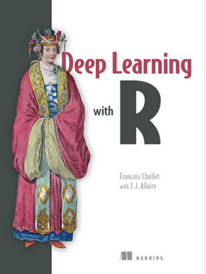

```{r initial, echo = FALSE, cache = FALSE, warning = FALSE, message = FALSE, error=FALSE, results = 'hide'}
library(knitr)
options(htmltools.dir.version = FALSE, tibble.width = 60)
opts_chunk$set(
  message = FALSE, 
  warning = FALSE, 
  error = FALSE, 
  echo = FALSE,
  fig.retina = 3
)
library(tidyverse)
library(kableExtra)
```

```{r xaringan-themer, include=FALSE}
#library(xaringanthemer)
#solarized_light(
#  text_font_family = list(google_font("Lato")),
#)
library(tidyverse)
```

class: inverse middle
background-image: url(images/redgum.jpg)
background-position: 100% 110%
background-size: 30%

# What Can Statistical Graphics Speak to Us About Deep Learning and Complex Models?

<br>
<br>
### .lightgreen[Professor Di Cook <br> Econometrics and Business Statistics <br>Monash University]


<br>
.green[JSM '21, Aug 12 (2AM Aug 13) 2021]


---
class: inverse middle
background-image: url(images/redgum.jpg)
background-position: 110% 0%
background-size: 50%

- .lightgreen[Dr Kevin Moon] <br> Introduction to Deep Learning <br> for Computer Vision <br> <br>
- .lightgreen[Dr Susan VanderPlas] <br> How Do You Define a Circle? <br> Perception and Computer Vision Diagnostics <br><br>
- .lightgreen[Dr Stuart Lee] <br> Casting Multiple Shadows:  High-Dimensional <br>Interactive Data Visualization with Tours <br>and Embeddings 

---
class: inverse middle

# Key points from each talk

# How the topics are related

# Challenges for statistical graphics

---
class: inverse middle

# Kevin Moon: deep learning

I like to think about a deep learning model using a different diagram

---

Thinking about images as data, requires unpacking into variables:

<center>

</center>

---


- Proximity in an image matters though. 
- The dimension reduction takes into account of neighbouring cells in the image, using filters


---
# Susan VanderPlas: shoe prints

.left-code[

Computer vision model trained to distinguish different shoe treads.

A lot of graphics used to diagnose the model fit. 
]

.right-plot[


]

---
# Stuart Lee: High-d vis

.left-code[
These vis techniques can be used to help understand the results from deep learning. Here's an example for classifying [Google Quickdraw Sketches](https://quickdraw.withgoogle.com).
]

.right-plot[
<center>

</center>
]

---

.left-code[

<center>

</center>

]

.right-plot[
<center>

</center>
]

---
class: inverse middle 
# Human vs computer

- Giora Simchoni's post and talks
- Our experiments in getting computer to do our chores

---
background-image: url(images/simchoni.png)
background-size: 80%

---
.left-code[
Trained a computer vision two ways:

- classification, significant correlation vs not
- regression, to predict the correlation

.green[Success, picked plot 16]
]
.right-plot[

<center>

</center>
]
---
.left-code[
Trained a computer vision two ways:

- classification, significant correlation vs not
- regression, to predict the correlation

.green[Success, failed to pick plot 4]
]
.right-plot[
<center>

</center>
]

---
.left-code[
Trained a computer vision two ways:

- classification, significant correlation vs not
- regression, to predict the correlation

.pink[Fail! Doesn't see the strong nonlinear association. Picks the most linear.]
]
.right-plot[

]

---
background-image: url(images/simchoni2.png)
background-size: contain

[Giora Simchoni's JSM 2019 talk](http://giorasimchoni.com/deep_visual_inference.html#/1)

---

.left-code[
Our experiment 1: training computer to read residual plot
]

.right-plot[

<br>
<br>

<table>
<tr> <td> Rank </td> <td> Test type </td> <td> Number correct</td> <td> Proportion </td> </tr>
<tr> <td> 1 </td> <td> human </td> <td> 47/70 </td> <td> 0.67 </td> </tr>
<tr> <td> 2 </td> <td> t-test </td> <td> 43/70 </td> <td> 0.61 </td> </tr>
<tr> <td> 3 </td> <td> computer </td> <td> 39/70 </td> <td> 0.55 </td> </tr>
</table>
]

---

Our experiment 2: training computer to read residual plot

.left-code[


]
.right-plot[

<table>
<tr> <th> </th> <th> </th> <th colspan="2"> Computer </th> </tr>
<tr> <th> </th> <th>  </th> <th> Not </th> <th> Linear </th> </th> </tr>
<tr> <th rowspan="2"> Human </th> <th> Not </th> <td> 27 </td> <td> 0 </td> </tr>
<tr>  <th> Linear </th> <td> 15 </td> <td> 28 </td> </tr>
</table>
]

---
# Software

The [keras](https://keras.rstudio.com) package in R, interfaces to python software, provides a convenient way to fit the convolutional neural network. 




---
# Things to work on `r icon::fa_rocket()`

- Visualisation for computer vision model fits to
    - diagnose 
    - interpret 
- Computer vision models to do some of the analysis work that we typically duck, e.g. read residual plots


---
class: middle center

<a rel="license" href="http://creativecommons.org/licenses/by-sa/4.0/"></a><br />This work is licensed under a <a rel="license" href="http://creativecommons.org/licenses/by-sa/4.0/">Creative Commons Attribution-ShareAlike 4.0 International License</a>.


