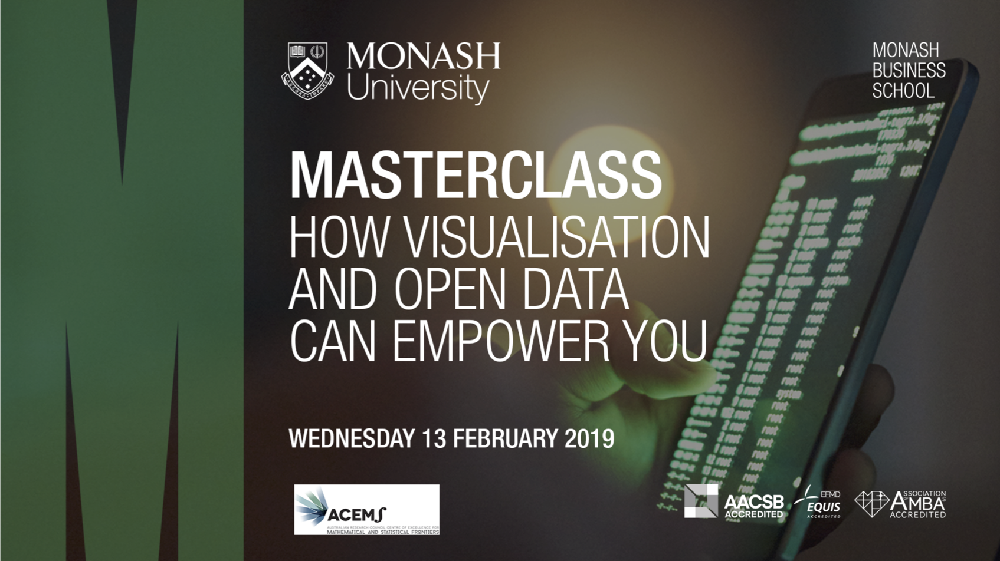
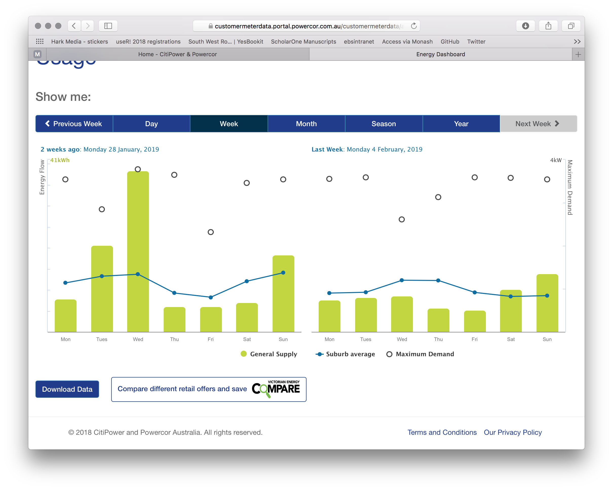
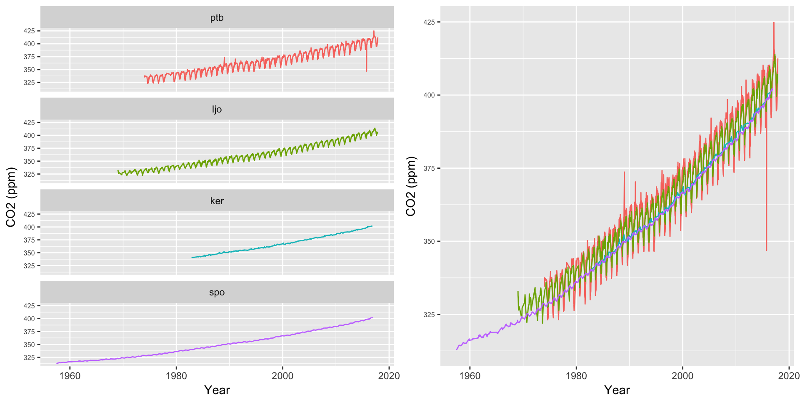

```{r setup, include=FALSE}
library(knitr)
knitr::opts_chunk$set(tidy = FALSE, 
                      message = FALSE,
                      warning = FALSE,
                      echo = FALSE)
options(htmltools.dir.version = FALSE)
```

class: title-slide   


---
class: split-25 hide-slide-number


.column.bg-green[

.white[H. G. Wells (1903) Mankind in the Making

*"Statistical thinking will one day be as necessary for efficient citizenship as the ability to read and write!"*]]

.column[.content[
# .font2[.green[How visualisation and open data can empower you]]

## .blue[Di Cook <br> <br>]

## .light-green[Professor of Business Analytics <br>] 
### .indigo[Econometrics and Business Statistics] <br>
### .indigo[`r icon::fa_university()`Monash University <br> <br>  <br>]

.light-blue[`r icon::fa_twitter()`] .teal[@visnut] &nbsp;&nbsp;&nbsp;&nbsp;
.black[`r icon::fa_github()`] .teal[dicook] &nbsp;&nbsp;&nbsp;&nbsp;
.deep-orange[`r anicon::faa("slideshare", animate="vertical")`] [dicook.org/MBS_ACEMS](http://dicook.org/MBS_ACEMS)
]]

---

layout: true
class: shuriken-full hide-slide-number

.blade1.bg-blue[.content.center[
# .white[Open data, open source]
]]
.blade2.bg-light-green[.content.vertical-rl.center[
# .blue[Data is available everywhere today, publicly, free]
]]
.blade3.bg-light-blue[.content.center[
# .pink[Software, very powerful software, for analysis of data is available publicly, free]
]]
.blade4.bg-green[.content.sideways-center.vmiddle[
# .yellow[A little know-how about plotting data (maybe some math and stat)]
]]
.gray-hole[.content.center.vmiddle[
{{content}}
]]

---

class: hide-blade2 hide-blade3 hide-blade4 hide-hole

---

class: hide-blade3 hide-blade4 hide-hole
count: false

---

class: hide-blade4 hide-hole
count: false

---

class: hide-hole
count: false

---
layout: false
class: split-70 hide-slide-number

.column[.content.nopadding[
```{r, fig.retina = 1, out.width="120%"}
include_graphics("images/energy_compare.png", dpi="70")
```
]]
.column.bg-white.pad10px[
<br>
## A local example <br> <br>
.bg-yellow.black[.font2[Claim your bonus $50]] <br> <br>
You need to download your data, and upload to the comparison site.
<br> <br> <br> <br> <br> <br> <br>  <br> <br>
*.light-green[Now that you have your data, you can make a few plots of your usage too!]*
]


---

layout: true
class: shuriken-full hide-slide-number

.blade1[.content.center.black.nopadding[
```{r, fig.retina = 1, out.width="90%"}
include_graphics("images/energy_distributors.png", dpi="70")
```
]]
.blade2[.content.vmiddle[
### [Find your distributor](https://www.energy.vic.gov.au/electricity/electricity-distributors) <br>
### Create an account, using your meter number which you can find on a current bill<br><br><br>
### .lime[Dashboard summarises usage]<br>
]]
.blade3[.content.center[

]]
.blade4[.content.center[
<br> <br> <br> <br> <br> <br> 
.font3[It's easy `r emo::ji("joy")`]
]]


---
layout: false

```{r readdata}
library(tidyverse)
library(lubridate)
library(glue)
library(tsibble)
library(sugrrants)
library(emo)
library(kableExtra)
elec <- read_csv("data/di.csv", skip=1,
                 col_names = c("id", "date", paste0("d", 1:48), paste0("stuff", 1:5)),
                 col_types = "ccddddddddddddddddddddddddddddddddddddddddddddddddccccc")
elec %>% select(id:d15) %>% head(20) %>% kable()
```

.bgcolor_alert[Raw data]

---
class: split-40
.column.pad10px[
# Wrangling

<br> <br> <br>
```{r, fig.retina = 1, out.width="90%"}
include_graphics("images/data-science-wrangle.png", dpi="70")
```

.footnote[Image from [R4DS](https://r4ds.had.co.nz/wrangle-intro.html)]
]
.column.pad10px[

<br>

```{r wrangle}
elec <- elec %>% filter(id == 300)
elec <- elec %>%
  mutate(date = ymd(date)) %>%
  select(id:d48) %>%
  gather(halfhour, kwh, d1:d48) %>%
  mutate(halfhour = as.numeric(sub("d", "", halfhour))/2) %>%
  arrange(date, halfhour) %>%
  mutate(wday = wday(date, label = TRUE, abbr = TRUE,
                     week_start = 1),
         month = month(date, label = TRUE, abbr = TRUE),
         year = year(date)) %>%
  mutate(dt = ymd_hm(glue("{date} 12:00"),
                     tz = "Australia/Melbourne") +
           minutes(60*halfhour))
elec %>% head(15) %>% kable()
```

<br> <br> <br>  
.bgcolor_alert[Well-defined variables and observations are data-times, half-hour chunks]
]


---
class: split-40
.column.pad50px[
## Think about what you want to know 
<br> 
.font3[`r emo::ji("thinking")`]
]

.column.font2[
<br> <br> <br> <br> <br>  
.green[What does my energy usage look like?] 

Need to be more specific than that. 

- is there a difference in use by day of the week?
- what's the daily pattern?
- are some months more energy intensive than others?
- how does it look over time?

.light-green[What's a "kwh"? It doesn't really mean much, so let's examine it relatively.]
]
---
class: split-50

.column[.pad50px[
# is there a difference in use by day of the week?

<br>
.font2[Energy use is added up for each day. The distribution of daily usage is displayed against day of the week, using a .deep-orange[violin plot] with quartiles and medians marked.]

<br> <br>

*.light-green[Typically more energy use over the weekends, and Tuesday/Thursday during the week. These latter two days, especially Thursday is usually a work from home day.]*

]]
.column[.pad50px[
```{r boxplot, fig.width=5, fig.height=5, out.width="100%", fig.retina=3}
elec %>% 
  filter(date < dmy("01022019"), date >= dmy("01022018")) %>%
  group_by(date) %>%
  summarise(dkwh = sum(kwh, na.rm=TRUE)) %>%
  mutate(wday = wday(date, label = TRUE, abbr = TRUE,
                     week_start = 1)) %>%
  ggplot(aes(x=wday, y=dkwh)) + geom_violin(draw_quantiles=c( 0.25, 0.5, 0.75)) +
  ylab("Total daily kwh") +
  xlab("")
```
]]

---
# what's the daily pattern?

<br>
.font[Add a new variable indicating whether the day is a holiday (weekend or public holiday for Victoria, function available in the tsibble package). Examine the distribution of usage for each half-hour using a .deep-orange[boxplot].] 


```{r time, echo=FALSE, fig.width = 10, fig.height = 3.5, out.width="100%", fig.retina=3, fig.align='center'}
vic_holidays <- holiday_aus(2017:2019, state = "VIC")
elec <- elec %>% 
  mutate(work = ifelse(wday %in% c("Mon", "Tue", "Wed", "Thu", "Fri"), "workday", "holiday")) %>%
  mutate(work = ifelse(date %in% vic_holidays$date, "holiday", work))

elec %>%
  filter(date < dmy("01022019"), date >= dmy("01022018")) %>%
  ggplot(aes(x=halfhour, y=kwh, group=halfhour)) +
  geom_boxplot() +
  facet_wrap(~work)
```


*.light-green[There is a strong work day vs weekend pattern. The week day typically has less usage in the middle of the day. Weekend has relatively constant usage. Both types of days though often begins around 7am, and ends around 9-10pm. There is a stripe of "outliers" on both types of days, that indicates constant high energy usage.]*

---
# daily usage?

.font2[Usage by hour plot displayed over each day day, in a .deep-orange[calendar] plot, just for January and February 2018. Colour indicates holiday or working day.] 

```{r calendar, echo=FALSE, fig.width = 9, fig.height = 3.5,  out.width="100%", fig.retina=3, fig.align='center'}
p1 <- elec %>%
  filter(date < dmy("01032018"), date >= dmy("01012018")) %>%
  frame_calendar(x = halfhour, y = kwh, date = date, ncol = 4) %>%
  ggplot(aes(x = .halfhour, y = .kwh, group = date, colour=factor(work))) +
  geom_line() +
  scale_colour_brewer("work", palette = "Dark2") +
  theme(legend.position="none")
prettify(p1)
```

*In the USA, central air runs continuously in the summer, and central heating in the winter, and a clothes dryer is used to dry clothes.*

---
class: split-30

.column.pad10px[
# How does this compare with my friends?

<br> <br> <br>

.font2[Comparing January 2018 usage across households]

]
.column.pad10px[
```{r compare, fig.width = 7.5, fig.height = 6,  out.width="95%", fig.retina=3, fig.align='center'}
friend1 <- read_csv("data/friend1.csv", skip=1,
                 col_names = c("id", "date", paste0("d", 1:48), paste0("stuff", 1:5)),
                 col_types = "ccddddddddddddddddddddddddddddddddddddddddddddddddccccc")
friend1 <- friend1 %>% filter(id == 300)
friend1 <- friend1 %>%
  mutate(date = ymd(date)) %>%
  select(id:d48) %>%
  gather(halfhour, kwh, d1:d48) %>%
  mutate(halfhour = as.numeric(sub("d", "", halfhour))/2) %>%
  arrange(date, halfhour) %>%
  mutate(wday = wday(date, label = TRUE, abbr = TRUE,
                     week_start = 1),
         month = month(date, label = TRUE, abbr = TRUE),
         year = year(date)) %>%
  mutate(dt = ymd_hm(glue("{date} 12:00"),
                     tz = "Australia/Melbourne") +
           minutes(60*halfhour))
friend2 <- read_csv("data/friend2.csv", skip=1,
                 col_names = c("id", "date", paste0("d", 1:48), paste0("stuff", 1:5)),
                 col_types = "ccddddddddddddddddddddddddddddddddddddddddddddddddccccc")
friend2 <- friend2 %>% filter(id == 300)
friend2 <- friend2 %>%
  mutate(date = ymd(date)) %>%
  select(id:d48) %>%
  gather(halfhour, kwh, d1:d48) %>%
  mutate(halfhour = as.numeric(sub("d", "", halfhour))/2) %>%
  arrange(date, halfhour) %>%
  mutate(wday = wday(date, label = TRUE, abbr = TRUE,
                     week_start = 1),
         month = month(date, label = TRUE, abbr = TRUE),
         year = year(date)) %>%
  mutate(dt = ymd_hm(glue("{date} 12:00"),
                     tz = "Australia/Melbourne") +
           minutes(60*halfhour))
friend3 <- read_csv("data/friend3.csv", skip=1,
                 col_names = c("id", "date", paste0("d", 1:48), paste0("stuff", 1:5)),
                 col_types = "ccddddddddddddddddddddddddddddddddddddddddddddddddccccc")
friend3 <- friend3 %>% filter(id == 300)
friend3 <- friend3 %>%
  mutate(date = ymd(date)) %>%
  select(id:d48) %>%
  gather(halfhour, kwh, d1:d48) %>%
  mutate(halfhour = as.numeric(sub("d", "", halfhour))/2) %>%
  arrange(date, halfhour) %>%
  mutate(wday = wday(date, label = TRUE, abbr = TRUE,
                     week_start = 1),
         month = month(date, label = TRUE, abbr = TRUE),
         year = year(date)) %>%
  mutate(dt = ymd_hm(glue("{date} 12:00"),
                     tz = "Australia/Melbourne") +
           minutes(60*halfhour))
di <- elec %>% mutate(household = "di")
friend1 <- friend1 %>% mutate(household = "friend1")
friend2 <- friend2 %>% mutate(household = "friend2")
friend3 <- friend3 %>% mutate(household = "friend3")
elec_all <- bind_rows(di, friend1, friend2, friend3)
p1 <- elec_all %>%
  filter(month == "Jan", year == 2018) %>%
  frame_calendar(x = halfhour, y = kwh, date = date, ncol = 1) %>%
  ggplot(aes(x = .halfhour, y = .kwh, group = date, colour = household)) +
  geom_line() +
  scale_colour_brewer("household", palette = "Dark2") +
  theme(legend.position="none") +
  facet_wrap(~household, ncol=2)
prettify(p1)
```
]

---
class: split-50

.column.pad50px[
# is my usage different this year?

.font2[January 2018 and 2019.] 
<br>
<br>

```{r }
elec %>% filter(month == "Jan") %>% group_by(year) %>% summarise(kwh = sum(kwh)) 
```

<br>
<br>
<br>
*.light-green.font2[Becoming less of an energy hog, maybe more Australian.]*

]
.column[
```{r calendar2, echo=FALSE, fig.width = 4, fig.height = 7, out.width="60%", fig.align='center', fig.retina=3}
p1 <- elec %>%
  filter(month == "Jan") %>%
  frame_calendar(x = halfhour, y = kwh, date = date, ncol = 1) %>%
  ggplot(aes(x = .halfhour, y = .kwh, group = date, colour=factor(work))) +
  geom_line() +
  scale_colour_brewer("work", palette = "Dark2") +
  theme(legend.position="none")
prettify(p1)
```
]


---
class: split-50

.column.pad50px[
# is my usage different this year?

.font2[February 2018 and 2019.] 
<br>
<br>

```{r }
elec %>% filter(month == "Feb") %>% group_by(year) %>% summarise(kwh = sum(kwh)) 
```

<br>
<br>
<br>
*.light-green.font2[So far its looking good.]*

]
.column[
```{r calendar3, echo=FALSE, fig.width = 4, fig.height = 7, out.width="60%", fig.align='center', fig.retina=3}
p1 <- elec %>%
  filter(month == "Feb") %>%
  frame_calendar(x = halfhour, y = kwh, date = date, ncol = 1) %>%
  ggplot(aes(x = .halfhour, y = .kwh, group = date, colour=factor(work))) +
  geom_line() +
  scale_colour_brewer("work", palette = "Dark2") +
  theme(legend.position="none")
prettify(p1)
```
]


---

class: bg-teal center middle hide-slide-number

.reveal-text.bg-white[.pad1[
.font4[# *A few more stories* `r emo::ji("gymnastics")`]
]]

---
class: split-50

.column.pad50px[
# Learning about Melbourne 

.font2[[Pedestrian counting system](http://www.pedestrian.melbourne.vic.gov.au) has about 40 sensors dotted around Melbourne city.]

<br> <br> 

.font2[Here are the counts from last week, for four train stations]

<br> <br>

.font2[`r emo::ji("shock")` .light-green[*Hmm, no data for two of these.* ]]

]
.column.pad10px[
```{r ped, fig.width = 6, fig.height = 6, out.width="100%", fig.align='right', fig.retina=3, cache=TRUE}
library(rwalkr)
ped <- melb_walk()
ped_sub <- ped %>% filter(Sensor %in% c("Melbourne Central", "Flinders Street Station Underpass", "Southern Cross Station", "Flagstaff Station")) %>%
  mutate(weekend = ifelse(wday(Date, label=TRUE) %in% c("Sat", "Sun"), "yes", "no"))
ggplot(ped_sub, aes(x=Time, y=Count, group=Date, colour=weekend)) + 
  geom_line() +
  facet_wrap(~Sensor, ncol=2) +
  scale_color_brewer(palette="Dark2")
```
]

---
class: split-50

.column.pad50px[
# Learning about Melbourne 

July 2016
]
.column.pad10px[
```{r ped2, fig.width = 6, fig.height = 6, out.width="100%", fig.align='right', fig.retina=3, cache=TRUE}
library(rwalkr)
ped2 <- melb_walk(from = ymd("2016-07-01"), to = ymd("2016-07-31"))
ped_sub2 <- ped2 %>% filter(Sensor %in% c("Melbourne Central", "Flinders Street Station Underpass", "Southern Cross Station", "Flagstaff Station")) %>%
  mutate(weekend = ifelse(wday(Date, label=TRUE) %in% c("Sat", "Sun"), "yes", "no"))
ggplot(ped_sub2, aes(x=Time, y=Count, group=Date, colour=weekend)) + 
  geom_line() +
  facet_wrap(~Sensor, ncol=2) +
  scale_color_brewer(palette="Dark2")
```
]

---
class: split-50
.column.pad10px[
# PISA
<br>

.font2[
- OECD Programme for International Student Assessment
- Triennial survey of workforce readiness of 15 year olds, across 60-70 countries. Approximately 14,000 Australian students from 700 schools are surveyed each time. 
- 2015 survey
]

<br> <br>
[Download data](http://www.oecd.org/pisa/data/)
]
.column.nopadding[

]
---
class: split-50
count: false

.column.pad10px[
# PISA
<br>

.font2[
- OECD Programme for International Student Assessment
- Triennial survey of workforce readiness of 15 year olds, across 60-70 countries. Approximately 14,000 Australian students from 700 schools are surveyed each time. 
- 2015 survey
]

<br> <br>
[Download data](http://www.oecd.org/pisa/data/)

<br> <br>
.deep-orange[Math gap is not universal!]

]
.column.nopadding[

]

---


---


---

# Climate - CO2



Download data from http://scrippsco2.ucsd.edu/data/atmospheric_co2/. 
---
class: split-three

.column[
# .right[Monash]


https://www.ala.org.au

<br>
.center[Magpies]

```{r monash, fig.width = 6, fig.height = 6, out.width="100%", fig.align='center', fig.retina=3}
library(ggmap)
library(ggthemes)
library(forcats)
monash <- read_csv("data/monash_species.csv")
#monash %>% select(`Event Date - parsed`) %>% summary()
recent <- monash %>% filter(Kingdom == "Animalia") %>%
  filter(`Event Date - parsed` > ymd("2010-01-01")) %>% filter(!is.na(`Vernacular name`)) %>% count(`Vernacular name`, sort=TRUE) %>% top_n(9) 
past <- monash %>% filter(Kingdom == "Animalia") %>%
  filter(`Event Date - parsed` < ymd("1980-01-01"), `Event Date - parsed` > ymd("1910-01-01")) %>%
  filter(!is.na(`Vernacular name`)) %>% count(`Vernacular name`, sort=TRUE) %>% top_n(9) 
load("data/monash_map.rda")

ggmap(map) + 
  geom_point(data=filter(monash, `Vernacular name` == "Australian Magpie"), aes(x=Longitude, y=Latitude), colour = "orange" ) + theme_map()
```
]
.column[

# .center[wildlife]

.center[Main species we see .pink[now]]

```{r,  fig.width = 6, fig.height = 6, out.width="100%", fig.align='center', fig.retina=3}
library(ggwordcloud)
library(viridis)
ggplot(recent, aes(label=`Vernacular name`, size=n, colour=n)) + 
  geom_text_wordcloud() +
  scale_size_area(max_size = 12) +
  scale_colour_viridis_c() +
  theme_bw()
```
]
.column[
# .left[ecosystem]

.center[What people saw .pink[before 2010]]

```{r,  fig.width = 6, fig.height = 6, out.width="100%", fig.align='center', fig.retina=3}
ggplot(past, aes(label=`Vernacular name`, size=n, colour=n)) + 
  geom_text_wordcloud() +
  scale_size_area(max_size = 12) +
  scale_colour_viridis_c() +
  theme_bw()
```
]
---
class: bg-teal center middle hide-slide-number

.reveal-text.bg-white[.pad1[
.font3[*"If someone feeds you a fish you eat for a day, but if you learn to fish, you eat for a lifetime"* `r emo::ji("fish")`]
]]

---
class: split-two black with-thick-border middle border-white bg-black

.column[
.split-two[
.row.bg-light-green[.content.indigo[
# Privacy
<br>
.font2[Smart meter data: only YOU can download your data. Your account is created using your meter id. My friends gave me their data. Previously the electricity company had access to all of this, and we had to rely on their summaries and their interpretation.]
]]
.row.bg-green[.content.indigo[
<br><br><br><br>
.font2[PISA: Has been privatised, raw scores are not returned, predicted values using the model]
]]]]

.column[
.split-two[
.row.bg-blue[.content[
<br><br><br><br>
.font2[Pedestrian: Numbers bundled by hour, just counts, no individual information or images
]]]
.row.bg-light-blue[.content[
<br><br><br><br>
.font2[Monash wildlife comes from the Atlas of Living Australia, data is scientist and citizen contributed. Messy.]
]]]]

---

class: bg-teal center middle hide-slide-number

.reveal-text.bg-white[.pad1[
.font4[~~All I Really Need to Know I Learned in Kindergarten~~]
]]

---
layout: true
class: shuriken-300 white 

.blade1.bg-blue[.content.center[
<br>
# .white[Get] [R](https://cran.r-project.org) .white[(the airplane) and] <br> [RStudio](https://www.rstudio.com/products/rstudio/download/) .white[(the airport terminal)]
]]
.blade2.bg-yellow[.content.vertical-rl.center[
### .blue[get some more graphics insight with [Data Visualization: A practical introduction](https://socviz.co/index.html) Kieran Healy]
]]
.blade3.bg-white[.content.center[
<br><br>
## .pink[Start reading and working through] [R for Data Science](https://r4ds.had.co.nz) .pink[by Wickham and Grolemund]
]]
.blade4.bg-lime[.content.vertical-rl.center.vmiddle[
.purple[### Join a meetup group: [R Ladies Melbourne](https://www.meetup.com/en-AU/R-Ladies-Melbourne/) or [MelbURN](https://www.meetup.com/en-AU/MelbURN-Melbourne-Users-of-R-Network/)
]]]
.hole.bg-black[.content.center.vmiddle[
## .lime[You can get started by]
]]

---

class: hide-blade1 hide-blade3 hide-blade2 hide-blade4 
count: false

---

class: hide-blade3 hide-blade2 hide-blade4
count: false

---

class: hide-blade2 hide-blade4
count: false

---

class: hide-blade4
count: false

---

count: false

---
layout: false
class: split-40

.column.pad50px.bg-green[
# .white[Benefits for data providers]
]
.column.pad50px[
.row[.content[
<br>
]]
.row[.content[
<br>
]]
.row[.content[
.font3[&nbsp;&nbsp;&nbsp;&nbsp;&nbsp;&nbsp;&nbsp;&nbsp;&nbsp;&nbsp;&nbsp;&nbsp;&nbsp;&nbsp;Free error-checking]
]]
.row[.content[
.font3.light-blue[&nbsp;&nbsp;&nbsp;&nbsp;&nbsp;&nbsp;&nbsp;&nbsp;&nbsp;&nbsp;&nbsp;&nbsp;&nbsp;&nbsp;Free analysis]
]]
.row[.content[
.font3.green[&nbsp;&nbsp;&nbsp;&nbsp;&nbsp;&nbsp;&nbsp;&nbsp;&nbsp;&nbsp;&nbsp;&nbsp;&nbsp;&nbsp;Goodwill and trust]
]]
.row[.content[
.font3.light-green[&nbsp;&nbsp;&nbsp;&nbsp;&nbsp;&nbsp;&nbsp;&nbsp;&nbsp;&nbsp;&nbsp;&nbsp;&nbsp;&nbsp;Reproducibility]
]]
]

---
layout: true
class: shuriken-300 white 

.blade1[.content.center[
<br>
# .blue[With a laptop loaded with R, and access to open data]
]]
.blade2.bg-yellow[.content.vertical-rl.center[
### .blue[With knowledge of randomisation (bootstrap, permutation, simulation)]
]]
.blade3.bg-white[.content.center[
<br><br>
## .pink[Ability to make data plots (grammar of graphics, appropriate mapping of variables to graphical elements)]
]]
.blade4.bg-lime[.content.vertical-rl.center.vmiddle[
### .purple[We can learn a lot about our world
]]]
.hole.bg-black[.content.center.vmiddle[
## .lime[Power to the people]
]]


---
layout: false
# `r set.seed(2019); emo::ji("technologist")` Thanks!

### Slides and code at [dicook.org/MBS_ACEMS](http://dicook.org/MBS_ACEMS).
<br>

### R software is used generate plots, using [tidyverse](https://www.tidyverse.org), and [tidyverts](https://github.com/tidyverts) tools for time series, including [sugrrants](https://github.com/earowang/sugrrants) for calendar plots, and [rwalkr](https://github.com/earowang/rwalkr), [wordclouds](https://cran.r-project.org/web/packages/ggwordcloud/vignettes/ggwordcloud.html) and emojis with [emo](https://github.com/hadley/emo). 
<br>

### Created using [R Markdown](https://rmarkdown.rstudio.com) with flair by [**xaringan**](https://github.com/yihui/xaringan), and [**kunoichi** (female ninja) style](https://github.com/emitanaka/ninja-theme).

<br> <br> <br>
<a rel="license" href="http://creativecommons.org/licenses/by-sa/4.0/"></a><br />This work is licensed under a <a rel="license" href="http://creativecommons.org/licenses/by-sa/4.0/">Creative Commons Attribution-ShareAlike 4.0 International License</a>.
