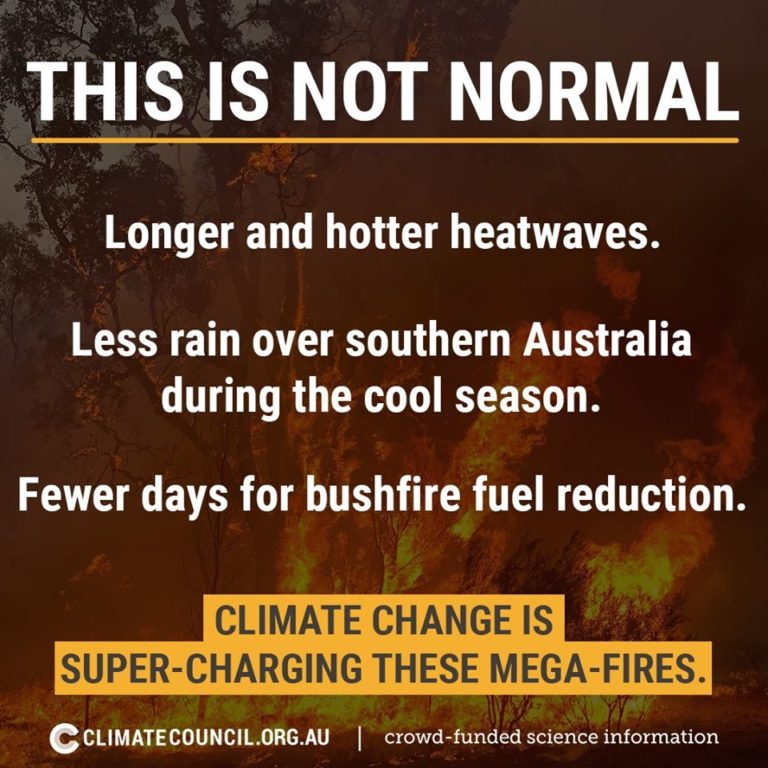
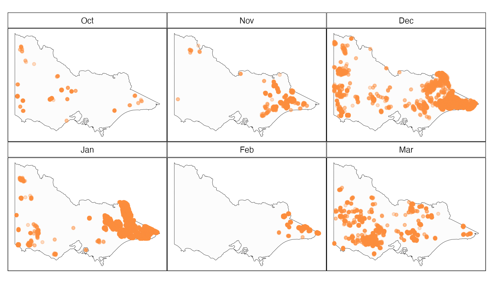
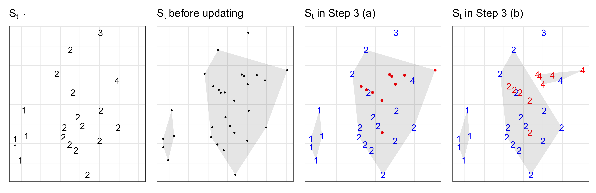
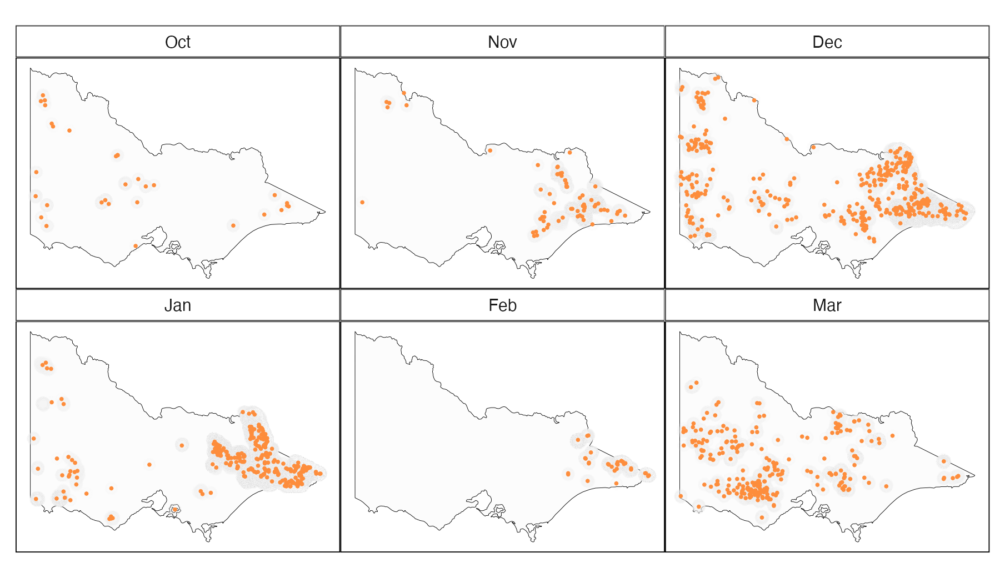
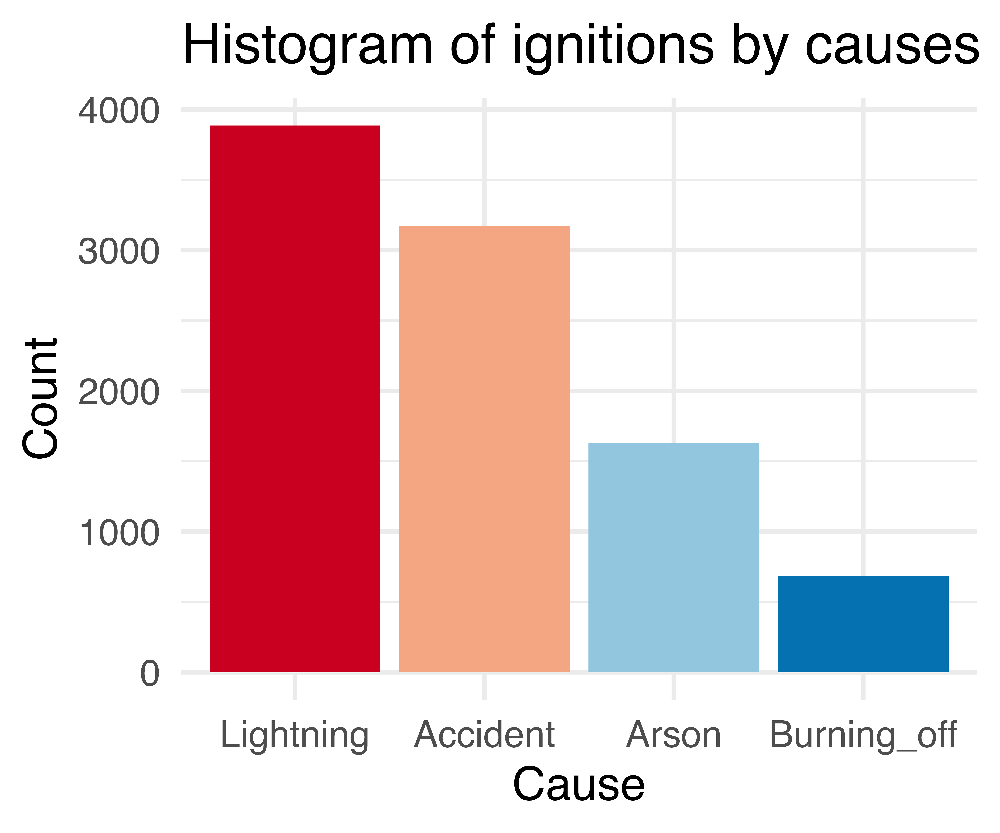
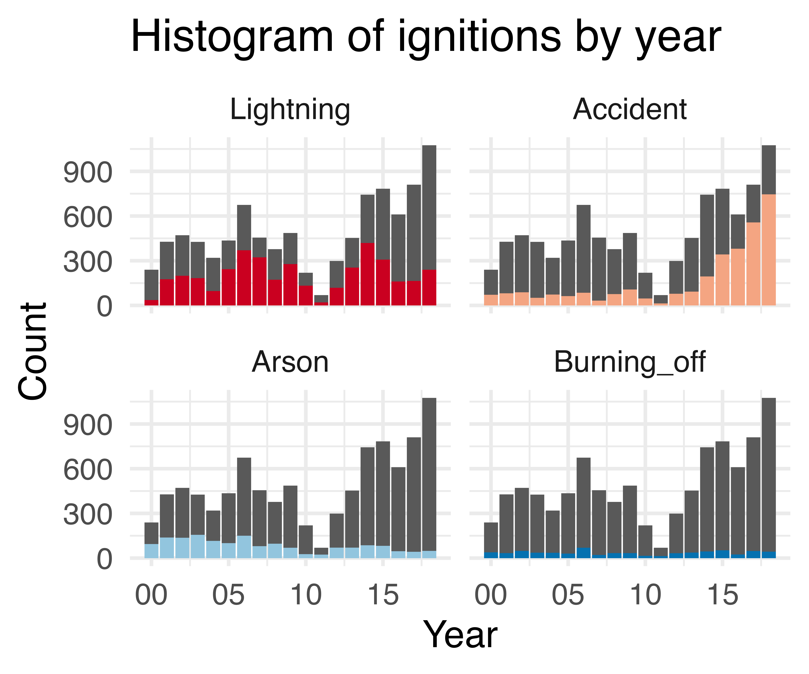
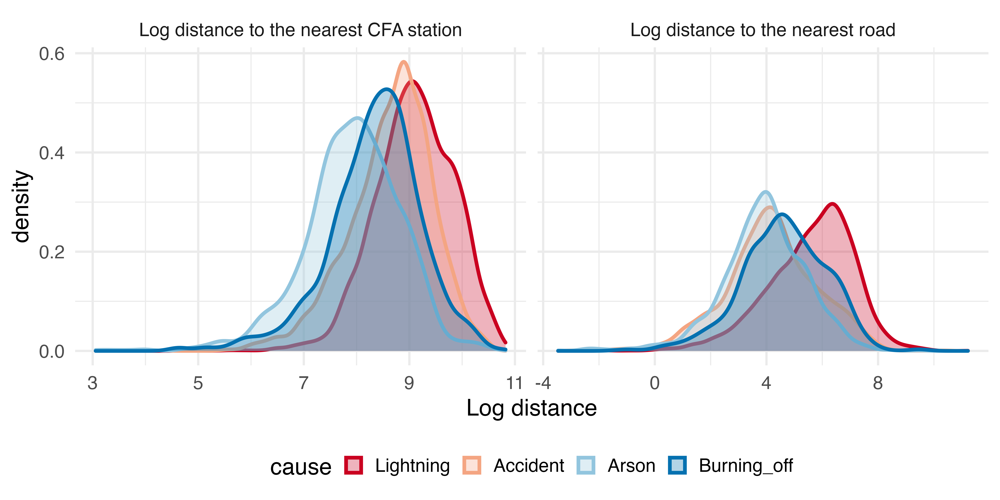

```{r setup, include=FALSE}
knitr::opts_chunk$set(
  echo = FALSE, 
  message = FALSE, 
  warning = FALSE,
  fig.retina = 5)
```

```{r libraries}
library(tidyverse)
library(patchwork)
library(gganimate)
library(ggthemes)
library(plotly)
library(kableExtra)
```

```{r titleslide, child="components/titleslide.Rmd"}
```

---
# Outline

<br><br>
- Motivation
- Examples
    - OECD PISA standardised scores
    - Bush fire causes
- Open data, open source software, plotting data, statistical thinking
- How do you get started or further develop your skills?

```{r eval=FALSE}
library(learningtower)
student <- load_student("all")
save(student, file="data/student.rda")
```

---
background-image: url(images/australia_slipping.png)
background-size: cover


---
# Media coverage: Test scores

<br><br>Every time the OECD PISA scores are released there are press articles lamenting the [decline in Australian scores]((https://theconversation.com/vital-signs-australias-slipping-student-scores-will-lead-to-greater-income-inequality-128301). And how badly Australian girls perform in math relative to boys. 
--

<br><br>The same can be observed in other countries, including [New Zealand]((https://www.stuff.co.nz/national/education/117890945/new-zealand-topend-in-oecds-latest-pisa-report-but-drop-in-achievements-worrying), and [Indonesia]((https://www.thejakartapost.com/news/2019/12/04/not-even-mediocre-indonesian-students-score-low-in-math-reading-science-pisa-report.html). 

---
# Media coverage of Australian bushfires (2019-2020)


Who do you believe? Is it lightning 🌩️ or 🔥 arson?


<a href="https://twitter.com/MRobertsQLD/status/1220588928706568193">  </a>



---
class: transition middle

# 1. Test scores

<br>

# 2. Bushfire ignition causes

---
class: transition middle

# OECD PISA Standardised test scores

---
# Getting the data

<br> <br> <br>

- [OECD PISA](https://www.oecd.org/pisa/): Testing of 15 yr olds conducted every three years since 2000, from 43 to now 90 countries, and from 125k to now 600k students
- `learningtower` package in R (Wang, Yacobellis, Siregar, Romanes, Fitter, Valentino Dalla Riva, Cook, Tierney, Dingorkar, 2021)

---
# Change in scores (and countries participating) over time

.pull-left[

<br> 

```{r fig.width = 6, fig.height = 6, out.width="110%"}
load("data/student_anim_data.rda")
gif <- ggplot(student_anim_data,
       aes(x=math_avg, y=read_avg,
           color = continent, group = country_name)) +
  geom_point(size=3, alpha=0.5) +
  geom_label(data = filter(student_anim_data,
                          country_name %in%
                            c("Australia",
                              "Indonesia", 
                              "Qatar",
                              "Singapore",
                              "Malaysia",
                              "Finland",
                              "Canada",
                              "Germany",
                              "Thailand",
                              "Colombia",
                              "Chile",
                              "USA")), 
            aes(label = country_name, 
                group = country_name), 
            fill = "white", size=4) +
  theme_minimal() +
  theme(legend.position = "none", 
        #axis.line = element_blank(), 
        aspect.ratio=1) +
  transition_states(year, 
                    transition_length = 3,
                    state_length = 1,
                    wrap = FALSE)   +
  scale_colour_brewer("", palette = "Dark2") +
  labs(title = 'Year: {closest_state}',
       x = "Math",
       y = "Reading") +
  xlim(c(250, 650)) + ylim(c(300, 600)) +
  enter_fade() + exit_fade()

animate(gif, fps = 5, end_pause = 4) 
```
]
.pull-right[
<br><br>
Australia has performed consistently well over the years. Small drift down in recent years.

<br><br>
Malaysia makes an appearance in 2009, drops out in 2015 and returns 2018.

<br>
Qatar and Singapore enter late and grow quickly

]

---
# Gender gap: selected countries 2018 scores

```{r PISA, fig.width=8, fig.height=4, out.width="100%"}
# See https://github.com/priya51096/paper-learningtower
# For code to compute the confidence intervals
load("data/math_diff_conf_intervals.rda")
load("data/read_diff_conf_intervals.rda")
load("data/sci_diff_conf_intervals.rda")

# Select countries for readable plot

countries_selected <- c("Qatar", 
                        "Australia", 
                        "Malaysia",
                        "Colombia",
                        "Germany",
                        "Finland",
                        "Singapore",
                        "Canada",
                        "USA",
                        "Morocco",
                        "Indonesia",
                        "Israel",
                        "Greece",
                        "South Korea",
                        "Netherlands",
                        "Poland")

# Plot math
math_plot <- math_diff_conf_intervals %>%
  filter(country_name  %in% countries_selected) %>% 
  ggplot(aes(x=diff, y=country_name,
                        colour = score_class)) +
  geom_hline(data=filter(math_diff_conf_intervals,
                         country_name %in% 
                           c("Malaysia", "Australia")),
             aes(yintercept=country_name), 
             colour = "#fdae61", size=3, alpha=0.5) +
  geom_vline(xintercept = 0, color = "#969696") +
  geom_point(size=3) +
  geom_errorbar(aes(xmin = lower, xmax = upper),
                width=0, size=2, alpha=0.7) +
  scale_colour_manual("",
      values = c("boys"="#4d9221",
                 "nodiff"="#FFFFFF",
                 "girls"="#c51b7d")) +
  labs(y = "",
  x = "",
  title = "Math"
  ) +
  theme(legend.position="none") +
  annotate("text", x = 50, y = 1, label = "Girls") +
  annotate("text", x = -50, y = 1, label = "Boys") +
  scale_x_continuous(limits = c(-70, 70),
                     breaks = seq(-60, 60, 20),
                     labels = abs(seq(-60, 60, 20)))

read_plot <- read_diff_conf_intervals %>%
  filter(country_name  %in% countries_selected) %>% 
  ggplot(aes(x=diff, y=country_name,
                        colour = score_class)) +
  geom_hline(data=filter(read_diff_conf_intervals,
                         country_name %in% 
                           c("Malaysia", "Australia")),
             aes(yintercept=country_name), 
             colour = "#fdae61", size=3, alpha=0.5) +
  geom_vline(xintercept = 0, color = "#969696") +
  geom_point(size=3) +
  geom_errorbar(aes(xmin = lower, xmax = upper),
                width=0, size=2, alpha=0.7) +
  scale_colour_manual("",
      values = c("boys"="#4d9221",
                 "nodiff"="#FFFFFF",
                 "girls"="#c51b7d")) +
  labs(y = "",
  x = "",
  title = "Reading"
  ) +
  theme(legend.position="none") +
  annotate("text", x = 50, y = 1, label = "Girls") +
  annotate("text", x = -50, y = 1, label = "Boys") +
  scale_x_continuous(limits = c(-70, 70),
                     breaks = seq(-60, 60, 20),
                     labels = abs(seq(-60, 60, 20)))

sci_plot <- sci_diff_conf_intervals %>%
  filter(country_name  %in% countries_selected) %>% 
  ggplot(aes(x=diff, 
             y=country_name,
             colour = score_class)) +
  geom_hline(data=filter(sci_diff_conf_intervals,
                         country_name %in% 
                           c("Malaysia", "Australia")),
             aes(yintercept=country_name), 
             colour = "#fdae61", size=3, alpha=0.5) +
  geom_point(size=3) +
  geom_errorbar(aes(xmin = lower, xmax = upper),
                width=0, size=2, alpha=0.7) +
  geom_vline(xintercept = 0, color = "#969696") +
  scale_colour_manual("",
      values = c("boys"="#4d9221",
                 "nodiff"="#FFFFFF",
                 "girls"="#c51b7d")) +
  labs(y = "",
  x = "",
  title = "Science"
  ) +
  theme(legend.position="none") +
  annotate("text", x = 50, y = 1, label = "Girls") +
  annotate("text", x = -50, y = 1, label = "Boys") +
  scale_x_continuous(limits = c(-70, 70),
                     breaks = seq(-60, 60, 20),
                     labels = abs(seq(-60, 60, 20)))
math_plot + read_plot + sci_plot
```

<center> Math gap .monash-blue2[is not] universal. Reading gap .monash-blue2[is] universal. </center>

---
# Math gap: 2018 scores

```{r make_map_data}
math_map_data <- math_diff_conf_intervals  %>%
  dplyr::mutate(country_name = 
    case_when(
      country_name == "Brunei Darussalam" ~ "Brunei",
      country_name == "United Kingdom" ~ "UK",
      country_name %in% c("Macau SAR China", 
                          "B-S-J-Z (China)", 
                          "Hong Kong SAR China") ~
        "China",
       country_name == "Korea" ~ "South Korea",
       country_name == "North Macedonia" ~
        "Macedonia",
       country_name == "Baku (Azerbaijan)" ~ "Baku",
       country_name %in% c("Moscow Region (RUS)",
                           "Tatarstan (RUS)",
                "Russian Federation") ~ "Russia",
       country_name == "Slovak Republic" ~ "Slovakia",
       country_name == "Chinese Taipei" ~ "Taiwan",
       country_name == "United States" ~ "USA",
       TRUE ~ as.character(country_name)))

world_map <- map_data("world") %>%
  filter(region != "Antarctica") %>%
  fortify() %>%
  rename(country_name = region)

math_world_data <- full_join(math_map_data,
                        world_map,
                        by = "country_name")

math_world_data <- math_world_data %>%
  rename(Country = country_name,
         math = diff)

read_map_data <- read_diff_conf_intervals %>%
  dplyr::mutate(country_name = 
    case_when(
      country_name == "Brunei Darussalam" ~ "Brunei",
      country_name == "United Kingdom" ~ "UK",
      country_name %in% c("Macau SAR China", 
                          "B-S-J-Z (China)", 
                          "Hong Kong SAR China") ~
        "China",
       country_name == "Korea" ~ "South Korea",
       country_name == "North Macedonia" ~
        "Macedonia",
       country_name == "Baku (Azerbaijan)" ~ "Baku",
       country_name %in% c("Moscow Region (RUS)",
                           "Tatarstan (RUS)",
                "Russian Federation") ~ "Russia",
       country_name == "Slovak Republic" ~ "Slovakia",
       country_name == "Chinese Taipei" ~ "Taiwan",
       country_name == "United States" ~ "USA",
       TRUE ~ as.character(country_name)))

read_world_data <- full_join(read_map_data,
                        world_map,
                        by = "country_name")

read_world_data <- read_world_data %>%
  rename(Country = country_name,
         read = diff)

math_dat <- math_world_data %>%
  dplyr::select(Country, math, lat, long, group)

read_dat <- read_world_data %>%
  dplyr::select(Country, read, lat, long, group)
```

```{r math_map, fig.width=12, fig.height=8, out.width="100%"}
math_map <- ggplot(math_dat,
       aes(x = long,
           y = lat,
           group = group)) +
  geom_polygon(aes(fill = math), 
               colour = "grey90") +
  scale_fill_distiller(palette = "PiYG", 
                       limits = c(-65, 65), 
                       na.value = "white", 
                       guide = "legend") +
  theme_map() +
  theme(aspect.ratio = 0.60, 
        legend.position = "bottom", 
        legend.direction = "horizontal")

math_map
```

---
# Reading gap: 2018 scores

```{r read_map, fig.width=12, fig.height=8, out.width="100%"}
read_map <- ggplot(read_dat,
       aes(x = long,
           y = lat,
           group = group)) +
  geom_polygon(aes(fill = read), 
               colour = "grey90") +
  scale_fill_distiller(palette = "PiYG", 
                       limits = c(-65, 65), 
                       na.value = "white", 
                       guide = "legend") +
  theme_map() +
  theme(aspect.ratio = 0.60, 
        legend.position = "bottom", 
        legend.direction = "horizontal")

read_map
```

---
# What we learn

<br> <br><br>
- Australia scores consistently highly, maybe small decline in recent years
- Gender gap is in reading, not math

---
class: transition middle

# Bush fire ignition cause

---
# 📂 Data Sources

.monash-red2[**🔥 Historical fire origins**]: 2000-2019 .font_my_2[[Department of Environment, Land, Water and Planning](https://discover.data.vic.gov.au/dataset/fire-origins-current-and-historical)]

.monash-red2[**📡 Remote sensing data**]: .font_my_2[[Japan Aerospace Exploration Agency](https://www.eorc.jaxa.jp/ptree/userguide.html)]

.font_my[
**Wind speed data**: 1-day, 7-day, ..., 2-year averages from .font_my_2[[Commonwealth Scientific and Industrial Research Organisation and Automated Surface Observing System](https://doi.org/10.25919/5c5106acbcb02)]

**Temperature, Rainfall and Solar exposure**: 1-day, 7-day , 14-day, 28-day, ..., 720-day averages computed from .font_my_2[[Bureau of Meteorology](https://CRAN.R-project.org/package=bomrang)]

**Fuel layer**: Forest type, forest height class, forest crown cover from .font_my_2[[Australian Bureau of Agricultural and Resource Economics](https://www.agriculture.gov.au/abares/forestsaustralia/forest-data-maps-and-tools/spatial-data/forest-cover)]

**Road map**: Proximity to the nearest road using .font_my_2[[OpenStreetMap](%20https://www.openstreetmap.org%20)]

**Fire stations**: Proximity to the nearest CFA station  .font_my_2[[Department of Environment, Land, Water and Planning](https://discover.data.vic.gov.au/dataset/cfa-fire-station-vmfeat-geomark_point)]

**Recreation sites**: Proximity to the nearest camping site .font_my_2[[Department of Environment, Land, Water and Planning](https://discover.data.vic.gov.au/dataset/recreation-sites)]
]

---
# 📡 Remote sensing data

Japan Aerospace Exploration Agency  provides a hotspot product (reflected energy from the earth) taken from the **Himawari-8** satellite, access as described in [Williamson gist](https://gist.github.com/ozjimbob/80254988922140fec4c06e3a43d069a6)


```{r}
if (!file.exists("images/hotspots_before.png")){
  library(rnaturalearth)
  library(ggthemes)
  library(lubridate)
  au_map <- ne_states(country = 'Australia', returnclass = 'sf')
  vic_map <- au_map[7,]
  VIC_hotspots_before_clustering <- read_csv("data/VIC_hotspots_before_clustering.csv") %>%
    mutate(date = as.Date("2019-10-01") + hours(time_id)) %>%
    mutate(month = month(date, label = TRUE)) %>%
    mutate(month = factor(month, levels = c("Oct", "Nov", "Dec", "Jan", "Feb", "Mar")))

  p <- ggplot(VIC_hotspots_before_clustering) +
    geom_sf(data = vic_map, fill = "grey99", 
            colour = "black", size=0.1) +
    geom_point(aes(lon, lat), size = 1, 
               alpha=0.3, colour = "#fd8d3c") +
    facet_wrap(~month, ncol=3) +
    theme_map() + 
    theme(strip.background = element_rect(fill="white"),
          panel.border = element_rect(colour="black", fill=NA))
  
  ggsave(p, filename = "images/hotspots_before.png", height = 3.5, width = 6, dpi = 300)
}
```




---

# 💻 Data fusion


---
# Detect ignitions by clustering hotspot data




Algorithm available in the `spotoroo` package (Li, Cook, Dodwell, 2021) and documented [here](https://github.com/TengMCing/Hotspots-Clustering-Algorithm/tree/master/paper-RJ).

---
# 💻 Estimated ignition spots

76,000 hotspots reduced to 1,000 ignition sites.

```{r}
if (!file.exists("images/hotspots_after.png")){
  library(rnaturalearth)
  library(ggthemes)
  library(lubridate)
  au_map <- ne_states(country = 'Australia', returnclass = 'sf')
  vic_map <- au_map[7,]
  VIC_hotspots_before_clustering <- read_csv("data/VIC_hotspots_before_clustering.csv") %>%
    mutate(date = as.Date("2019-10-01") + hours(time_id)) %>%
    mutate(month = month(date, label = TRUE)) %>%
    mutate(month = factor(month, levels = c("Oct", "Nov", "Dec", "Jan", "Feb", "Mar")))

  p <- ggplot(VIC_hotspots_before_clustering) +
    geom_sf(data = vic_map, fill = "grey99", 
            colour = "black", size=0.1) +
    geom_point(aes(lon, lat), size = 2, 
               alpha=0.05, colour = "grey90") +
    facet_wrap(~month, ncol=3) +
    theme_map() + 
    theme(strip.background = element_rect(fill="white"),
          panel.border = element_rect(colour="black", fill=NA))
  
  VIC_hotspots_after_clustering <- read_csv("data/VIC_hotspots_after_clustering.csv")
  hotspots <- read_csv("data/VIC_hotspots_raw.csv")
  
  VIC_hotspots_before_clustering$fire_id <- VIC_hotspots_after_clustering$fire_id
  VIC_hotspots_before_clustering$date <- hotspots$`#obstime`
  
  VIC_hotspots_after_clustering <- VIC_hotspots_before_clustering %>%
    group_by(fire_id) %>%
    summarise(time_id = min(time_id)) %>%
    left_join(VIC_hotspots_before_clustering) %>%
    group_by(fire_id, time_id) %>%
    summarise(lon = mean(lon), lat = mean(lat), 
              date = mean(date)) %>%
    mutate(month = month(date, label = TRUE)) %>%
    mutate(month = factor(month, levels = c("Oct", "Nov", "Dec", "Jan", "Feb", "Mar")))
  
  p <- p +
    geom_point(data = VIC_hotspots_after_clustering, 
               aes(lon, lat), alpha = 1, 
               size = 0.2, colour="#fd8d3c") 
  
  ggsave(p, filename = "images/hotspots_after.png", height = 3.5, width = 6, dpi = 300) 
}

```



<!--  -->

---
# 📊 Exploratory analysis of historical fire origins

```{r}
if (!file.exists("images/ignition_summary.png")){
library(tidyverse)
library(lubridate)
library(ggthemes)
library(rnaturalearth)

set.seed(357)

# Read in training data
training <- read_csv("data/training.csv")

training <- training %>%
  filter(!CAUSE %in% c("BURNING BUILDING",
                       "WASTE DISPOSAL, INDUSTRIAL, SAWMILL, TIP",
                       "WASTE DISPOSAL, DOMESTIC",
                       "BURNING VEHICLE, MACHINE",
                       "BURNING BUILDING")) %>%
  filter(new_cause != "other") %>%
  filter(new_cause != "relight")


training <- select(training, -c(EVENTID:FIRE_NUM), -id, -CAUSE, -FOREST, -FOR_CODE, -FOR_CAT)

training <- mutate(training,
                   year = factor(year(FIRE_START)),
                   month = factor(month(FIRE_START), levels = c(10,11,12,1,2,3)),
                   day = factor(day(FIRE_START), levels = c(1:31)),
                   wod = factor(wday(FIRE_START), levels = c(1:7)))

training <- filter(training, month %in% c(10,11,12,1,2,3))


training <- na.omit(training)

training <- mutate(training, new_cause = ifelse(new_cause == "accidental_human", "accident", new_cause)) %>%
  mutate(new_cause = ifelse(new_cause == "burning_off_human", "burning_off", new_cause)) %>%
  mutate(new_cause = factor(new_cause)) %>%
  mutate(FOR_TYPE = factor(FOR_TYPE))

training <- na.omit(training)

training <- mutate(training,
                   log_dist_cfa = log(dist_cfa),
                   log_dist_camp = log(dist_camp),
                   log_dist_road = log(dist_road),
                   COVER = factor(COVER),
                   HEIGHT = factor(HEIGHT))

training <- rename(training, cause = new_cause)
training <- mutate(training,
                   cause = fct_relevel(cause,
                                       "lightning",
                                       "accident",
                                       "arson",
                                       "burning_off"))

training <- na.omit(training)

p <- training %>%
        mutate(cause = factor(tools::toTitleCase(as.character(cause)), 
     levels = c("Lightning", "Accident", "Arson", "Burning_off"))) %>%
    ggplot() +
     geom_histogram(aes(cause, fill = cause), stat = "count") +
    theme_minimal(base_size = 40) +
    ggtitle("Histogram of ignitions by causes") +
    theme(legend.position = "none") +
    scale_fill_brewer(palette = "RdBu") +
    xlab("Cause") +
    ylab("Count") 
  
  ggsave(p, filename = "images/ignition_summary.png", height = 10, width = 12, dpi = 600)
  
p <- training %>%
  mutate(cause = factor(tools::toTitleCase(as.character(cause)), levels = c("Lightning", "Accident", "Arson", "Burning_off"))) %>%
    ggplot() +
  geom_bar(data = select(training, -cause), aes(as.Date(paste0(as.character(year), "-01-01")))) +
    geom_bar(aes(as.Date(paste0(as.character(year), "-01-01")), fill = cause)) +
    facet_wrap(~cause) +
    theme_minimal(base_size = 40) +
    ggtitle("Histogram of ignitions by year") +
    theme(legend.position = "none") +
    scale_fill_brewer(palette = "RdBu") +
    xlab("Year") +
    ylab("Count") +
    scale_x_date(date_labels = "%y")
  
  ggsave(p, filename = "images/ignition_year.png", height = 10, width = 12, dpi = 600)
}
  
```

.font_my_2[
Text processing of 26 causes, reduced to four major causes. Lightning and accident were the two main sources of historical bushfire ignitions, which took up 41% and 34% respectively. There were 17% bushfires caused by arson.
]





---
# 📊 Spatial distribution of historical fire origins

```{r}
if (!file.exists("images/density.png")){
  library(tidyverse)
library(lubridate)
library(ggthemes)
library(rnaturalearth)
au_map <- ne_states(country = 'Australia', returnclass = 'sf')
vic_map <- au_map[7,]

set.seed(357)

# Read in training data
training <- read_csv("data/training.csv")

training <- training %>%
  filter(!CAUSE %in% c("BURNING BUILDING",
                       "WASTE DISPOSAL, INDUSTRIAL, SAWMILL, TIP",
                       "WASTE DISPOSAL, DOMESTIC",
                       "BURNING VEHICLE, MACHINE",
                       "BURNING BUILDING")) %>%
  filter(new_cause != "other") %>%
  filter(new_cause != "relight")


training <- select(training, -c(EVENTID:FIRE_NUM), -id, -CAUSE, -FOREST, -FOR_CODE, -FOR_CAT)

training <- mutate(training,
                   year = factor(year(FIRE_START)),
                   month = factor(month(FIRE_START), levels = c(10,11,12,1,2,3)),
                   day = factor(day(FIRE_START), levels = c(1:31)),
                   wod = factor(wday(FIRE_START), levels = c(1:7)))

training <- filter(training, month %in% c(10,11,12,1,2,3))


training <- na.omit(training)

training <- mutate(training, new_cause = ifelse(new_cause == "accidental_human", "accident", new_cause)) %>%
  mutate(new_cause = ifelse(new_cause == "burning_off_human", "burning_off", new_cause)) %>%
  mutate(new_cause = factor(new_cause)) %>%
  mutate(FOR_TYPE = factor(FOR_TYPE))

training <- na.omit(training)

training <- mutate(training,
                   log_dist_cfa = log(dist_cfa),
                   log_dist_camp = log(dist_camp),
                   log_dist_road = log(dist_road),
                   COVER = factor(COVER),
                   HEIGHT = factor(HEIGHT))

training <- rename(training, cause = new_cause)
training <- mutate(training,
                   cause = fct_relevel(cause,
                                       "lightning",
                                       "accident",
                                       "arson",
                                       "burning_off"))

training <- na.omit(training)

  training %>%
  mutate(cause = factor(tools::toTitleCase(as.character(cause)), levels = c("Lightning", "Accident", "Arson", "Burning_off"))) %>%
  ggplot() +
      geom_density_2d_filled(aes(lon, lat), contour_var = "ndensity") +
      geom_sf(data = vic_map, fill = NA, col = "white") +
      facet_wrap(~cause)+
      ggtitle("2D conditional density plot of historical bushfire ignitions") +
    theme_map(base_size = 20) +
    theme(legend.position = "right",
          plot.margin = unit(c(0, 0, 0, 0), "pt")) +
    guides(fill = guide_legend(reverse = T)) -> p
  
  ggsave(p, filename = "images/density.png", height = 6, width = 12, dpi = 1200)
}


    
```

.font_my_2[
Roughly different spatial locations of ignition causes.  Lightning bushfires were concentrated in the east of Victoria. Bushfires caused by arson were near Bendigo!
]


---
# 📊 Proximity of historical fire origins

```{r}
if (!file.exists("images/density_cfa.png")){
    library(tidyverse)
library(lubridate)
library(ggthemes)
library(rnaturalearth)
au_map <- ne_states(country = 'Australia', returnclass = 'sf')
vic_map <- au_map[7,]

set.seed(357)

# Read in training data
training <- read_csv("data/training.csv")

training <- training %>%
  filter(!CAUSE %in% c("BURNING BUILDING",
                       "WASTE DISPOSAL, INDUSTRIAL, SAWMILL, TIP",
                       "WASTE DISPOSAL, DOMESTIC",
                       "BURNING VEHICLE, MACHINE",
                       "BURNING BUILDING")) %>%
  filter(new_cause != "other") %>%
  filter(new_cause != "relight")


training <- select(training, -c(EVENTID:FIRE_NUM), -id, -CAUSE, -FOREST, -FOR_CODE, -FOR_CAT)

training <- mutate(training,
                   year = factor(year(FIRE_START)),
                   month = factor(month(FIRE_START), levels = c(10,11,12,1,2,3)),
                   day = factor(day(FIRE_START), levels = c(1:31)),
                   wod = factor(wday(FIRE_START), levels = c(1:7)))

training <- filter(training, month %in% c(10,11,12,1,2,3))


training <- na.omit(training)

training <- mutate(training, new_cause = ifelse(new_cause == "accidental_human", "accident", new_cause)) %>%
  mutate(new_cause = ifelse(new_cause == "burning_off_human", "burning_off", new_cause)) %>%
  mutate(new_cause = factor(new_cause)) %>%
  mutate(FOR_TYPE = factor(FOR_TYPE))

training <- na.omit(training)

training <- mutate(training,
                   log_dist_cfa = log(dist_cfa),
                   log_dist_camp = log(dist_camp),
                   log_dist_road = log(dist_road),
                   COVER = factor(COVER),
                   HEIGHT = factor(HEIGHT))

training <- rename(training, cause = new_cause)
training <- mutate(training,
                   cause = fct_relevel(cause,
                                       "lightning",
                                       "accident",
                                       "arson",
                                       "burning_off"))

training <- na.omit(training)

p <-training %>%
  mutate(cause = factor(tools::toTitleCase(as.character(cause)), levels = c("Lightning", "Accident", "Arson", "Burning_off"))) %>%
    gather(key = "metric", value = "distance", log_dist_cfa, log_dist_road) %>%
    mutate(metric = ifelse(metric == "log_dist_cfa", "Log distance to the nearest CFA station", "Log distance to the nearest road")) %>%
    ggplot() +
    geom_density(aes(distance, colour = cause, 
                     fill = cause), size = 1.5,
                 alpha=0.3) +
    theme_minimal(base_size = 20) +
    theme(legend.position = "bottom") +
    xlab("Log distance") +
    scale_color_brewer(palette = "RdBu") +
    scale_fill_brewer(palette = "RdBu") +
    facet_wrap(~metric, scales = "free_x") 
  
  ggsave(p, filename = "images/density_cfa.png", height = 6, width = 12, dpi = 600)
  
}
```

.font_my_2[
Lightning-caused bushfires were further away from the CFA stations and roads. In contrast, bushfires caused by arson were closer to CFA stations and roads.
]




---
# 📐 Model performance

<br>
<br>

.monash-blue[The overall accuracy of our model was 74.95%.] 

- High accuracy with lightning and accident ignitions.  
- Less accurate predictions for arson and burning off. 


<br>

```{r}
data.frame(Lightning = c(703, 51, 18, 5, 777), 
           Accident = c(77, 494, 55, 8, 634),
           Arson = c(50, 89, 175, 11, 325),
           Burning_off = c(44, 38, 22, 32, 136),
           Total = c(874, 672, 270, 56, 1872)) %>%
  mutate(Lightning = c(paste0(Lightning[1:4], " (", round(Lightning[1:4]/Lightning[5], 2), ")" ), paste0(Lightning[5]))) %>%
  mutate(Accident = c(paste0(Accident[1:4], " (", round(Accident[1:4]/Accident[5], 2), ")" ), paste0(Accident[5]))) %>%
  mutate(Arson = c(paste0(Arson[1:4], " (", round(Arson[1:4]/Arson[5], 2), ")" ), paste0(Arson[5]))) %>%
  mutate(Burning_off = c(paste0(Burning_off[1:4], " (", round(Burning_off[1:4]/Burning_off[5], 2), ")" ), paste0(Burning_off[5]))) %>%
  `row.names<-`(c("Prediction:Lightning", "Prediction:Accident", "Prediction:Arson", "Prediction:Burning_off", "Total")) %>%
  knitr::kable("html", align = c('l', 'r', 'r', 'r', 'r', 'r'))  %>%
  kable_classic(full_width = F, html_font = "Cambria") %>%
  kable_styling(font_size = 20)
  
```


---

# 🔎  **Prediction for 2019-2020 Australia bushfires**


```{r out.width="100%"}
library(ggthemes)
library(rnaturalearth)
library(lubridate)
au_map <- ne_states(country = 'Australia', returnclass = 'sf')
vic_map <- au_map[7,]

read_csv("data/prediction_2019-2020.csv") %>%
  mutate(cause = factor(tools::toTitleCase(cause), levels = c("Lightning", "Accident", "Arson", "Burning_off"))) %>%
  ggplot() +
  geom_sf(data = vic_map, fill = "grey99") +
  geom_point(aes(lon, lat, col = cause, text = paste0("Mon: ", month.abb[month(time)])), size = 1.5, alpha = 1) +
  theme_map(base_size = 20) +
  theme(legend.position = "right") +
  # facet_wrap(~factor(month.abb[month(time)], levels = c("Oct", "Nov", "Dec", "Jan", "Feb", "Mar"))) +
  scale_color_brewer(palette = "RdBu")-> p

library(plotly)


ggplotly(p, tooltip = c("colour", "text"))

```

---
# 🔎 Summary of findings

.monash-blue[- Majority of the bushfires in 2019-2020 season were caused by **lightning**.]
- 138 bushfires caused by accidents which took up 14% of the total fires. Most of them were ignited in March. 
- 37 bushfires were caused by arsonists, and over half of them were in March.
- Very few planned burns were predicted after October 2019 which suggests the correctness of our model.

<br>

```{r}
read_csv("data/prediction_2019-2020.csv") %>%
  mutate(cause = factor(tools::toTitleCase(cause), levels = c("Lightning", "Accident", "Arson", "Burning_off"))) %>%
  mutate(month = factor(month.abb[month(time)], levels = c("Oct", "Nov", "Dec", "Jan", "Feb", "Mar"))) %>%
  group_by(cause, month) %>%
  count() %>%
  ungroup() %>%
  rename(Cause = cause) %>%
  spread(month, n) -> temp

temp[is.na(temp)] <- 0

temp$Total <- temp$Oct + temp$Nov + temp$Dec + temp$Jan + temp$Feb + temp$Mar
temp$Total <- paste0(temp$Total, " (", round(temp$Total/sum(temp$Total), 2), ")")

temp  %>%
  knitr::kable("html", align = c('l', 'r', 'r', 'r', 'r', 'r', 'r', 'r'))  %>%
  kable_classic(full_width = F, html_font = "Cambria") %>%
  kable_styling(font_size = 20)
  
```

---
# Shiny app: https://ebsmonash.shinyapps.io/VICfire/

```{r out.width="110%"}
knitr::include_app("https://ebsmonash.shinyapps.io/VICfire/", height = "550px") 
```

---
# What we learn

<br><br><br><br>
The catastrophic bush fires of 2019-2020 were primarily ignited by lightning

---
class: transition middle

# Getting started and further developing your skills

---
# Recommended resources

<br>

- [R for Data Science](https://r4ds.had.co.nz): An introduction to data analysis using R, with a tidyverse frame of mind.
- [Fundamentals of Data Visualization](https://clauswilke.com/dataviz/): Learn to make effective data plots.
- [Statistical Thinking for the 21st Century](https://statsthinking21.github.io/statsthinking21-core-site/index.html): Harness computational tools to explore variation and uncertainty.
- [Tidymodels
](https://www.tidymodels.org): Develop your statistical modeling and machine learning systematically and cohesively.
- [Tidy Tuesday](https://github.com/rfordatascience/tidytuesday): Practice your skills on a wide range of contemporary data sets.

---
# Summary

<br><br>

- I've shown you two examples where I have learned a lot about a topic in the news, with just .monash-blue2[open data] and my .monash-blue2[R skills], .monash-blue2[statistics] background and .monash-blue2[data visualisation skills]. 
- With open source software, that is .monash-blue2[R], and open data you can learn, a little statistical thinking, good data plotting skills, .monash-orange2[you too] can learn a lot about the world around you.
- These tools are .monash-blue2[powerful social and economic equalisers] for today's world, and can equip you to .monash-blue2[combat misinformation], and work to develop a .monash-blue2[better environment] around you.

---
```{r endslide, child="components/endslide.Rmd"}
```


