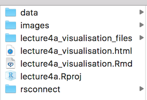
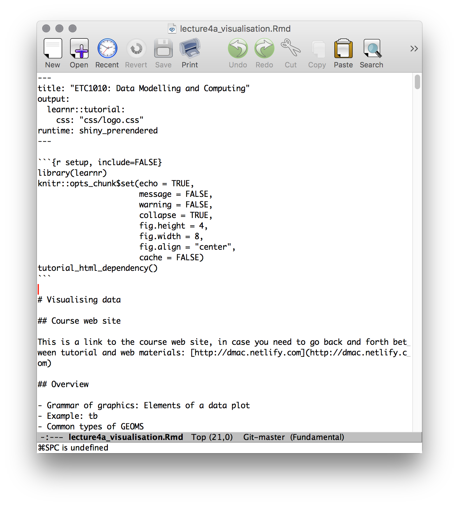
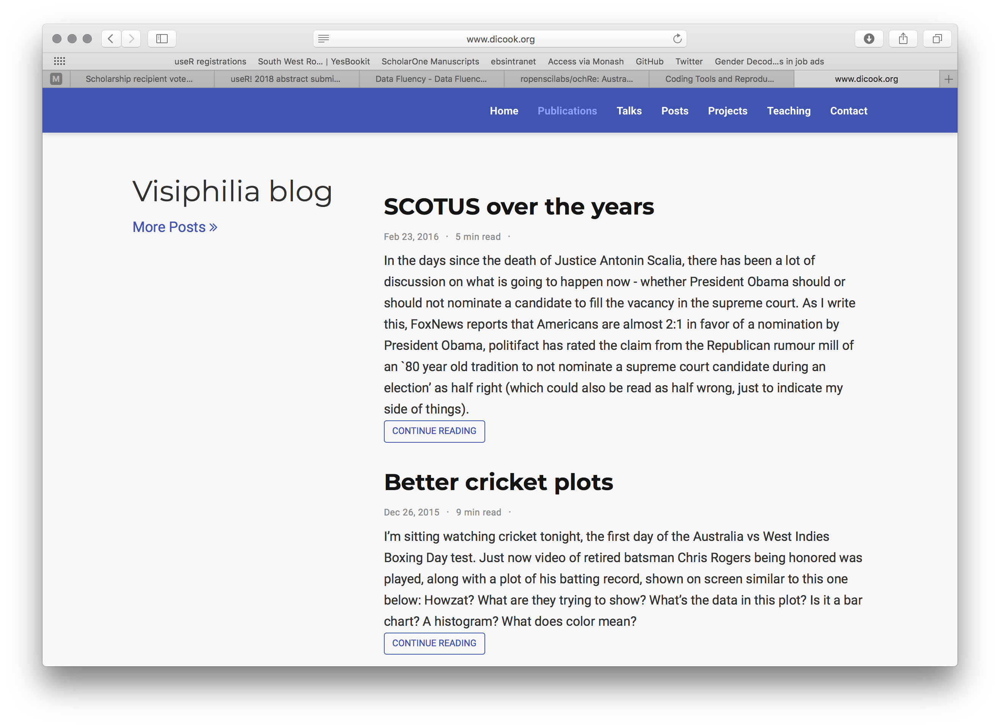
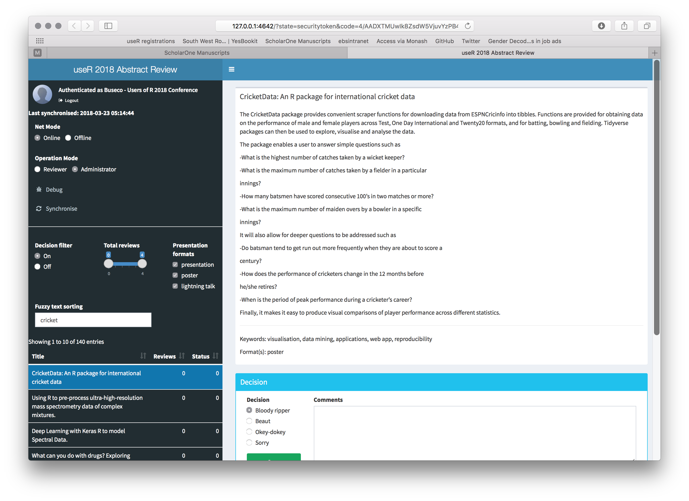
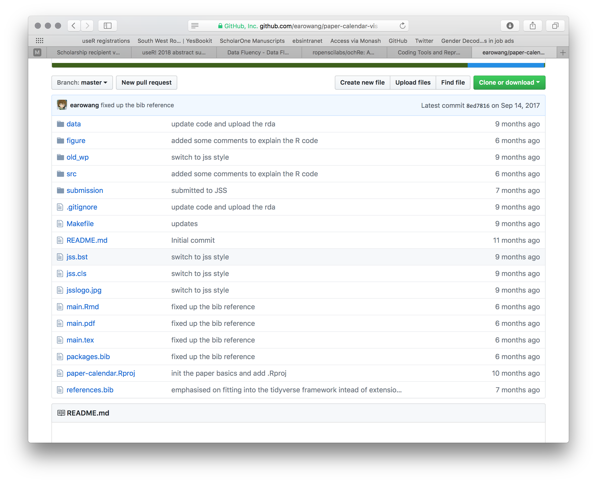
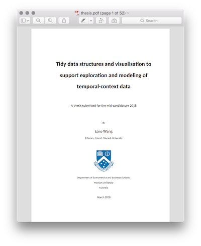

```{r initial, echo = FALSE, cache = FALSE, warning = FALSE, message = FALSE, error=FALSE, results = 'hide'}
library(knitr)
options(htmltools.dir.version = FALSE, tibble.width = 60)
opts_chunk$set(
  echo = FALSE, warning = FALSE, message = FALSE, error=FALSE, comment = "#>",
  fig.path = 'figure/', cache.path = 'cache/', fig.align = 'center', 
  fig.width = 12, fig.height = 11, fig.show = 'hold', 
  cache = TRUE, external = TRUE, dev = 'svglite'
)
library(tidyverse)
library(ochRe)
```


# Outline

- Talks, these slides
- Lecture notes
- Web site
- Publications
- Collaborative research

---
class: large center middle

All of these are made using the open source software R

[https://cran.r-project.org](https://cran.r-project.org)

---
class: large center middle

*"The goal of reproducible research is to tie specific instructions to data analysis and experimental data so that scholarship can be recreated, better understood and verified."* 

Max Kuhn, [CRAN Task View](https://cran.r-project.org/web/views/ReproducibleResearch.html) 

---
# Lecture notes

- Produced using the R packages `learnr`, `knitr`
- Data, code, explanations kept together
- Uploaded to the departmental [Shiny Server Pro](https://ebsmonash.shinyapps.io/lecture4a_visualisation/#section-example-tuberculosis-data)
- Students can re-run my slides, re-do the analysis, do parts of the analysis


---
# What it looks like



---
# Web site

- Produced with the R package `blogdown`
- Integrate data analysis examples into blog posts



---
# useR! 2018 is coming to Australia

- [useR! 2018 conference](https://user2018.r-project.org) web site built with R `pkgdown`
- Abstract submissions through Google forms, to Google sheets to automatically build program page
- Shiny app called "cooee" to review abstracts, draws directly from the Google sheet. Reviewers are blinded to name, affiliation, review based entirely on title, abstract, keywords and type of presentation. 
---



---
# Publications

- Written with R packages `Rmarkdown`, `knitr` with journal templates formats
- Code, data and explanations in one place
- Reviewers can reproduce the results reported, verify the work
- Books written with the R package `bookdown`



---
# Student thesis

- Students work with the [Monash thesis template produced by Rob Hyndman](https://github.com/robjhyndman/MonashThesis)




---
# Collaborative work

- **github:** a web-based hosting service for version control using git
- **appear.in:** for virtual meetings

---
# And you can do things like ...

```{r echo=FALSE, fig.height=4, fig.width=10}
library(rwalkr)
library(lubridate)

ped <- walk_melb(from=dmy("01032018"),
                 to=dmy("22032018"))
ped <- ped %>% 
  filter(Sensor %in% c("Melbourne Central", "Flinders Street Station Underpass"))

ggplot(ped) + 
  geom_line(aes(x=Date_Time, y=Count, colour=Sensor)) +
  scale_colour_brewer(palette="Dark2") + 
  theme(legend.position="bottom")
```

```{r eval=FALSE, echo=FALSE}
library(sugrrants)
calendar_df <- ped %>% 
  group_by(Sensor) %>%
  frame_calendar(x = Time, y = Count, date = Date, nrow = 4)
calendar_df %>% 
  filter(Sensor == "Melbourne Central") %>%
ggplot(aes(x = .Time, y = .Count, group = Date)) +
     geom_line()
prettify(p1, size = 3, label.padding = unit(0.15, "lines"))
    
```
